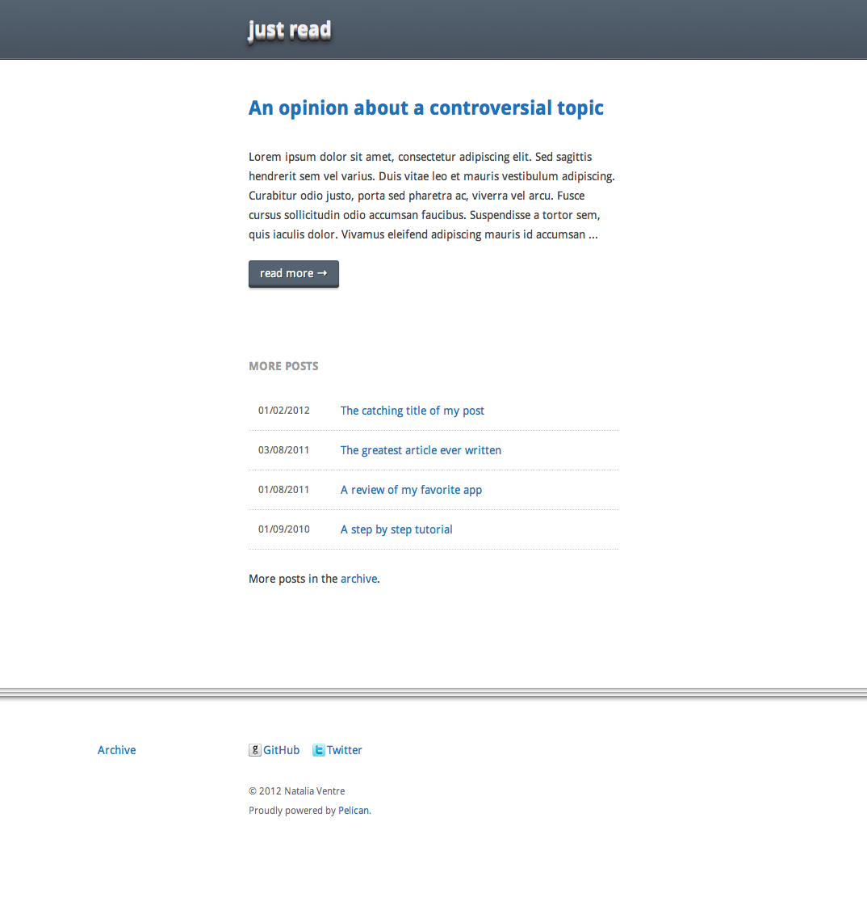

# Just Read

"Just Read" is a theme for [Pelican](http://alexis.notmyidea.org/pelican/). The fluid-width layout is based based on the Golden Grid System by [Joni Korpi](http://jonikorpi.com/).

## Worth mentioning files

- **pelican.com.py-sample** contains the variables used in the theme, use it as reference to build your own configuration file. 
- **var.less** defines the colors and fonts used. Much more easy to edit than the main.css file.
- the **psd folder** contains the images used in the theme, handful if you want to change the color scheme.

*Note: I tested the theme only in the latests version of Chrome, Firefox, Opera and Safari. *

## Screenshot ##

