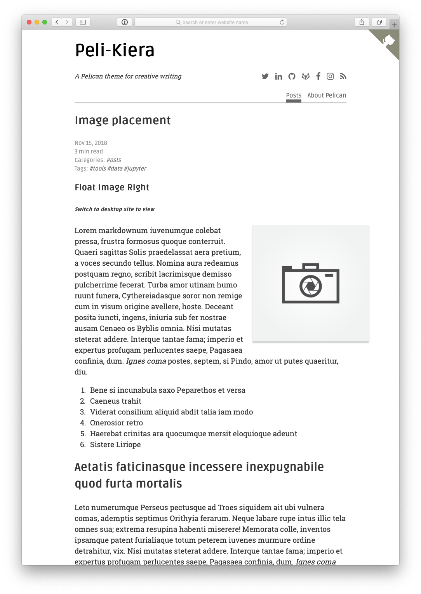

# Peli-Kiera

Peli-Kiera is a theme for the Pelican static site generator.
Thanks to the [Hugo-Kiera](https://github.com/avianto/hugo-kiera) project for the inspiration.
### Demo
Live-Demo at [https://aleylara.github.io/Peli-Kiera](https://aleylara.github.io/Peli-Kiera)
### Installation
[Pelican-Docs](https://docs.getpelican.com/en/stable/) will guide you through the initial installation.
Once inside the project directory, Peli-Kiera theme can be installed by cloning the repo into your 
themes path and pointing to it in your `pelicanconf.py`.
```bash  
# Create a themes directory if it doesn't exists
cd project-dir
pelican-quickstart
mkdir themes
cd themes
git clone https://github.com/aleylara/Peli-Kiera

# Add path to your theme directory in pelicanconf.py
THEME = 'themes/Peli-Kiera'
```
In order to get read times and links between articles, the theme requires [pelican-readtime](https://github.com/getpelican/pelican-plugins/tree/master/readtime) and [neighbors](https://github.com/getpelican/pelican-plugins/tree/master/neighbors) plugins.

```bash
cd project-dir/
# Please note the plugins repo is quite large and you only need the two.
git clone https://github.com/getpelican/pelican-plugins

# Add path to your plugins directory in pelicanconf.py
PLUGIN_PATHS = ['pelican-plugins']
PLUGINS = ['readtime', 'neighbors']
```
A sample article header.
```text
Title: Simple is better than complex 
Date: 2018-11-14
Tags: python, jupyter, library
Description: The Zen of Python
Category: Python

### Introduction

This is a standard paragraph. Lorem ipsum dolor sit amet, consectetuer adipiscing elit.
``` 
Go ahead and create few articles in respective directories.
```bash
# Generate articles and populate output
pelican content -o output -s pelicanconf.py
# start the local server on http://localhost:8000/
pelican --autoreload --listen
```

Final project directory structure should look similiar to this.

```bash
(Pelican) ➜ project-dir tree
│                                  
├── Makefile
├── content/
│   ├── Python/
│   │   ├── article-one.md
│   │   ├── article-two.md
│   │   └── article-three.md   
│   ├── Research/
│   │   ├── article-one.md
│   │   ├── article-two.md
│   │   └── article-three.md
│   ├── images/
│   │   ├── camera-2008479_640.png
│   │   ├── camera-wide.png
│   │   └── wide-wide.png
│   └── pages/
│       └── about.md
├── output/ 
│ 
├── pelicanconf.py
├── pelican-plugins/
│   ├── neighbors
│   │   ├── Readme.rst
│   │   ├── __init__.py
│   │   └── neighbors.py
│   └── readtime
│       ├── README.md
│       ├── __init__.py
│       └── readtime.py     
├── publishconf.py
├── tasks.py
└── themes
    └── Peli-Kiera/
```

### Settings
Example `pelicanconf.py`
    
```python
#!/usr/bin/env python
# -*- coding: utf-8 -*- #
from __future__ import unicode_literals

AUTHOR = 'Author'
COPYRIGHT = '2019'
SITENAME = 'Site-Name'
SITEURL = 'https://www.example.com'
SITESUBTITLE = 'Site Subtitle'
PATH = 'content'
TIMEZONE = 'America/New_York'
DEFAULT_LANG = 'en'

THEME = 'themes/Peli-Kiera'
PLUGIN_PATHS = ['pelican-plugins']
PLUGINS = ['readtime', 'neighbors']
STATIC_PATHS = ['images']
# Article summary length on main index page
SUMMARY_MAX_LENGTH = 100
DEFAULT_PAGINATION = 10
GITHUB_URL = 'https://github.com/'

# Feed generation is usually not desired when developing
FEED_ALL_ATOM = 'feeds/all.atom.xml'
CATEGORY_FEED_ATOM = None
TRANSLATION_FEED_ATOM = None
AUTHOR_FEED_ATOM = None
AUTHOR_FEED_RSS = None
RSS_FEED_SUMMARY_ONLY = True

# Social widget
SOCIAL = (
    ('twitter', 'https://twitter.com/'),
    ('linkedin', 'https://www.linkedin.com'),
    ('github', 'https://github.com/'),
    ('gitlab', 'https://gitlab.com/'),
    ('facebook', 'https://facebook.com'),
    ('instagram', 'https://instagram.com'),
)

# DISQUS_SITENAME = ''
# GOOGLE_ANALYTICS = ''

# Uncomment following line if you want document-relative URLs when developing
# RELATIVE_URLS = True
```

### Features
* Atom/RSS feeds
* Mobile friendly 
* Google analytics 
* Comments via Disqus
* Font awesome icons
* Modified pagination
* Image placements

### Pagination and image placement
The pagination is presented with the current page and 3 neighboring pages on either side. 
                                        
   <<  <   7  8  9  **10**  11  12  13  >  >>
      
Images can be moved on page by adding the tag `#float-right`, `#float-left`, `#mid` and `#full` in your markdown.

```markdown

``` 
  
Similarly, the placement can also be applied to html directly by wrapping images in a `<figure class="placement">` tag.

```html
<figure class="float-left">
    
</figure>
``` 
Minimum image width of 600px is recommended. Images scale accordingly on smaller screens.

### Preview



### License
[MIT License](https://github.com/avianto/hugo-kiera/blob/master/LICENSE.md)

