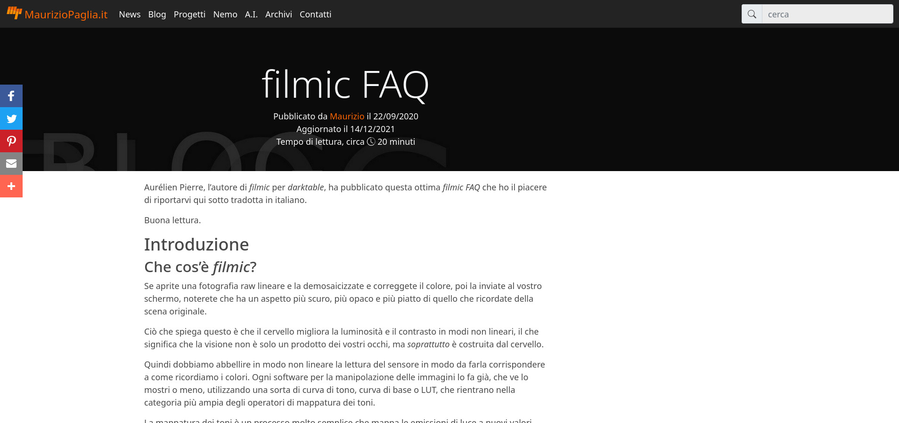
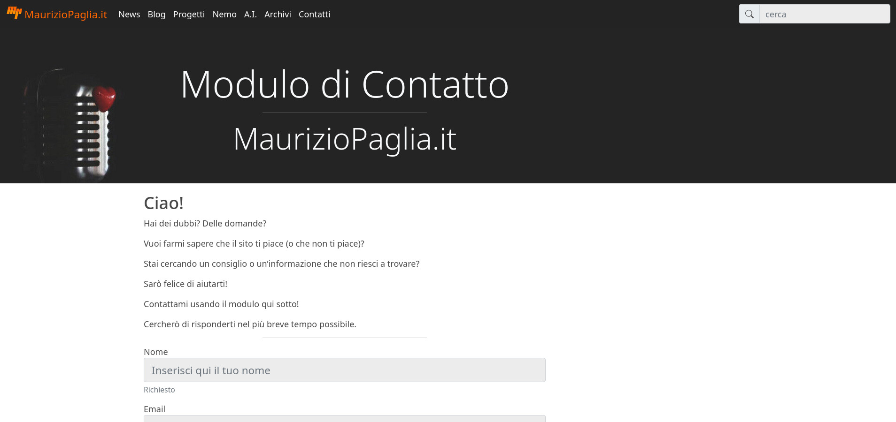
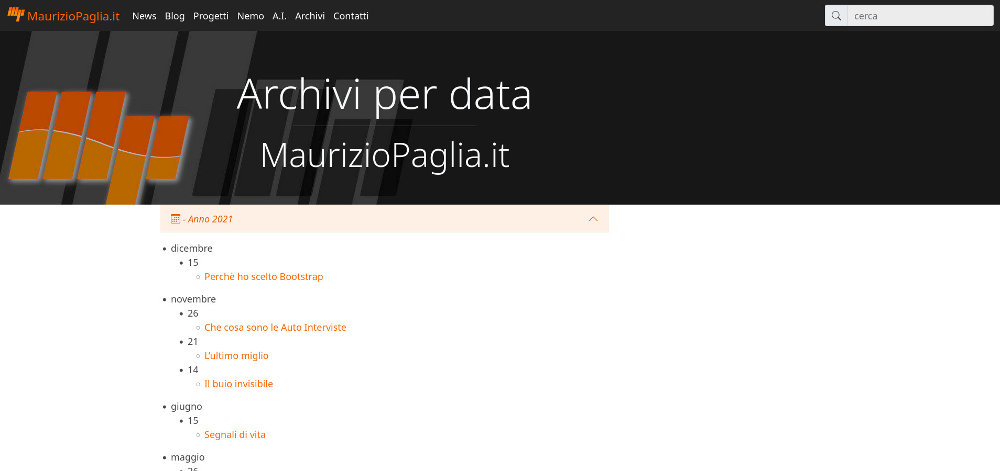
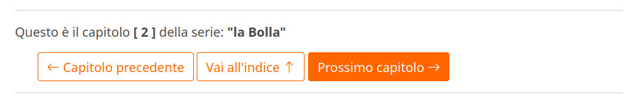
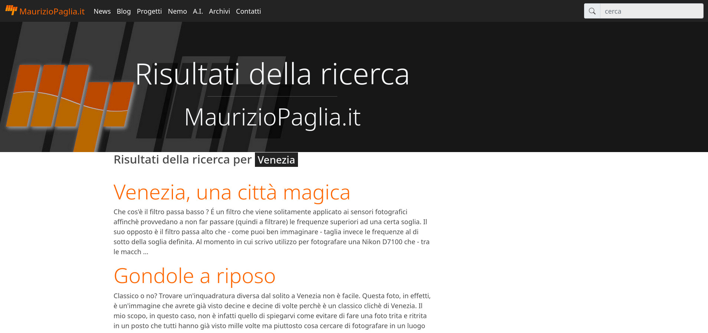
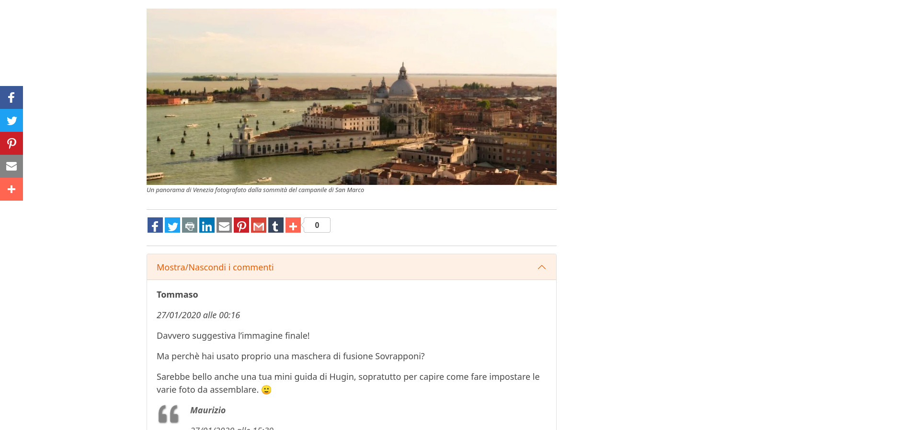

# This is **Z** (a Pelican theme)

Based on [Clean Blog layout](https://github.com/BlackrockDigital/startbootstrap-clean-blog).

:warning: needs [Pelican](https://blog.getpelican.com/) > ver. 4.0 (**tested untill ver. 4.7.1**)

## Some details...

HTML5 tags

Designed with [Bootstrap 5](https://getbootstrap.com/docs/5.1/getting-started/introduction/)

Customized Bootstrap CSS build from Sass sources at compile time and served locally (no more via CDN)

Bootstrap icons

No jQuery dependencies

All main browsers versions are supported except Internet Explorer that is no more supported in any of its versions!

## Screenshots

### Article/Page



### Contact form



### Archives



## Highlights

### Changed font

Changed the original *Open Sans* font with Bootstrap 5 native fonts.

### Contact Form

A Contact Form template is available in the ```template``` directory.

You can use it including the HTML code in a customized page.

:warning: needs a PHP capable hosting! PHP code is available in the ```static```directory.

### Integration of Series plugin

In order to use the [Series](https://github.com/pelican-plugins/series) plugin simply enter a ```:series:``` (reST) or ```Series:``` (Markdown) metadata in your article.

More information about how to configure your template are available on the plugin repository.



### Website Search

[**Tipue Search**](https://github.com/pelican-plugins/tipue-search) is a no more active project so it has been replaced by [**Lunr.js**](https://github.com/olivernn/lunr.js).



### Static Comments Plus

**For ethical/privacy reasons DISQUS comment system has been removed**.

[**Static Comments Plus**](https://github.com/mpaglia0/Static_Comments_Plus) has been hacked from [Static Comments](https://github.com/getpelican/pelican-plugins/tree/master/static_comments) plugin and has the following improvements:

- Added a ``STATIC_COMMENTS_SOURCE`` parameter in order to choose if comments have to be written in *Markdown* or *reST* format.

- Added a PHP script (available in the ```static``` directory) that will allow visitors to send comments through a form instead of an email (like Static Comments do).

:warning: Each article needs to have the ``slug`` metadata duly assigned in order to let this plugin works!



### Read time

A function that calculates and shows the approx. read time for articles has been added using the [Readtime](https://github.com/getpelican/pelican-plugins/tree/master/readtime) plugin.


# Basic theme configuration

:warning: All following configuration params are valid only for **Z** theme.

All properties have to be entered in ``pelicanconf.py``.

For your convenience, you can find a ``pelicanconf.py`` template in this repo. You can look here in order to have a good starting point.

### Header image Covers

To define custom header cover, set the property ``HEADER_COVER``:

```python
HEADER_COVER = 'enter/your/path/my_image.png'
```

### Header Color

To define a simple header background color, set the property ``HEADER_COLOR``:

```python
HEADER_COLOR = 'black'
```

You can use any valid CSS color definition.

### Social URLs

For Github, Twitter and other URLs set these properties:

```python
SOCIAL = (('twitter', 'https://twitter.com/myprofile'),
          ('github', 'https://github.com/myprofile'),
          ('facebook','https://facebook.com/myprofile'),
          ('flickr','https://www.flickr.com/myprofile/'),
	  ('mail','mailto:your@email.address'))
```

If you plan to use a Contact Module and you think to add its relevant icon among the Social ones, you could enter:

```python
SOCIAL = (('mail', 'https://your-domain/your-contact-module'))
```

If you have more links add them to SOCIAL. The Name has to be the name of the corresponding Bootstrap icon.
If ``SHOW_SOCIAL_ON_INDEX_PAGE_HEADER`` is set to ``True`` social icons will be
shown under site sub-title on the index page.

### External feed URL

You can specify an external feed URL (e.g. FeedBurner) in ``SOCIAL`` using the
``rss`` or ``rss-fill`` icons. The icon will be shown in the footer with the
rest of your ``SOCIAL`` accounts. A ``<link>`` tag for the external feed will be
placed in ``<head>`` instead of the default Pelican feeds.

### Single author tweak

Pelican has been designed for a multi-author site.

Clicking on each author name will redirected the visitor to a page containing all articles published by the selected author.
If you are the unique author of the blog, this behaviour causes a boring
loop since all articles belong only to you...

To avoid this set

```python
AUTHOR_URL = ''
AUTHOR_SAVE_AS = ''
AUTHORS_SAVE_AS = ''
```

so authors pages are not created on build time, and then

```python
SINGLE_AUTHOR_SAVE_AS = 'your-static-presentation-page/index.html'
```

in order to build a single static page dedicated to you.

### Back-To-Top button

This feature has been removed since ver. 2.0 of **Z**

### Code highlights

This theme contains this color schemes:

 - Tomorrow - ``tomorrow.css``;
 - Tomorrow Night - ``tomorrow_night.css``;
 - Monokai - ``monokai.css``;
 - Github - ``github.css``;
 - Github Jekyll (Gray BG Jekyll way) - ``github_jekyll.css``;
 - Darkly (Default) - ``darkly.css``;

To customize, define ``COLOR_SCHEME_CSS`` with CSS filename.

Example:

```python
COLOR_SCHEME_CSS = 'monokai.css'
```

### User defined CSS

Define ``CSS_OVERRIDE`` to insert a user defined CSS file
after theme CSS.

Example:

```python
CSS_OVERRIDE = 'enter/your/path/myblog.css'
```

### Customized theme JavaScript

Set ``DISABLE_CUSTOM_THEME_JAVASCRIPT`` to ``False`` if you want to use
your own JavaScript.

Starting from **Z ver. 2.0** ``Z.js`` has been completely removed but this feature
has been kept in order to let you use your own JavaScript (if needed).

### User defined footer

Define ``FOOTER_INCLUDE`` to insert a custom footer text
instead of the default "Powered by Pelican". The value is a template path. You also
need to define the ``EXTRA_TEMPLATES_PATHS`` setting. If your custom footer
template is stored under the content ``PATH`` then Pelican will try to render
it as regular HTML page and will most likely fail. To prevent Pelican from
trying to render your custom footer add it to ``IGNORE_FILES``.

Example:

```python
FOOTER_INCLUDE = 'myfooter.html'
IGNORE_FILES = [FOOTER_INCLUDE]
THEME_TEMPLATES_OVERRIDE = [os.path.dirname(__file__)]
```

:warning: Avoid using names which duplicate existing templates from the
theme directory, for example ``footer.html``. Due to how Pelican searches the
template directories it will first find the files in the theme directory and you
will not see the desired results.

### Dynamic Copyright year

Enter a ``COPY_DATE`` value if you need a static Copyright year.

If you need a dynamic Copyright year (i.e. the current year) proceed in this way:

1. At the beginning of your ``pelicanconf.py`` enter the Python function ``from datetime import date``
2. Then set ``DCOPY_DATE`` with value ``date.today().year``. This will return the current year.

You can use the static or the dynamic year or also both, like in the following example:

```python
COPY_DATE = '2015 -'
DCOPY_DATE = date.today().year
```

Will return -> **2015 - 2021**

### Analytics

**Removed Google Analytics for ethical/privacy reasons**.

Kept only the free Matomo (aka Piwik) system.

 - Matomo: ``MATOMO_URL`` and ``MATOMO_SITE_ID``.

:warning: needs new Matomo > 4.0

### Favicon

To define if using a favicon and its format:

```python
FAVICON = 'favicon.ico'
```

:warning: It is necessary ``STATIC_PATHS`` configured!

```python
STATIC_PATHS = ['images', 'extra/favicon.ico']
EXTRA_PATH_METADATA = {
    'extra/favicon.ico': {'path': 'favicon.ico'}
}
```

### CSS and JavaScript minification

:warning: [Webasset](https://github.com/pelican-plugins/webassets) plugin needed!

Minfication of CSS and JavaScripts is managed with the Webasset plugin, so this is a **REQUIRED** plugin.

Minification with Webasset comes fully configured. For more information you can visit the [plugin repo](https://github.com/pelican-plugins/webassets) or the [webasset documentation](https://webassets.readthedocs.io/en/latest/index.html).

### Other configuration parameters

 - If ``ADDTHIS_PUBID`` is defined, sharing buttons from AddThis will appear
 at the bottom of the article; (TODO - try to make this feature work together with addthis custom bar)
 - ``GOOGLE_SITE_VERIFICATION`` - Google site verification token;
 - ``BING_SITE_VERIFICATION`` - Bing site verification token;
 - Set ``SHOW_FULL_ARTICLE`` to ``True`` to show full article content on index.html
 instead of summary;
 - Set ``SHOW_SITESUBTITLE_IN_HTML`` to ``True`` to make use of the ``SITESUBTITLE``
 variable inside the ``<title>`` HTML tag;
 - Set ``FACEBOOK_ADMINS`` to a list of Facebook account IDs which are
 associated with this blog. For example ``['12345']``. For more info see
 https://developers.facebook.com/docs/platforminsights/domains

### Translation for templates strings

A gettext method has been used. This is enaugh if you have only a few strings to be translated (this is the case for templates).

At the bottom of your ``pelicanconf.py`` file enter the following instruction:

```python
# custom Jinja2 filter for localizing theme
def gettext(string, lang):
    if lang == "en":
        return string
    elif lang == "it":
        if string == "Archives": return "Archivi"
        elif string == "Archives for": return "Archivi per"
	elif string == "Posted by": return "Pubblicato da"
	...
        ...
        else: return string
        
 JINJA_FILTERS = {
     "gettext": gettext,
}
```

:warning: This method translates only template stings! Translating content is fully explained in Pelican documentation.

### Articles in deep

 - To customize header cover to articles, insert the metadata ``header_cover``.
 - To customize OpenGraph images, insert the metadata ``og_image``, otherwise
 ``header_cover``, ``HEADER_COVER`` or a default image is used.
 - To customize Twitter card images, insert the metadata ``twitter_image``,
 otherwise ``header_cover``, ``HEADER_COVER`` or a default image is used.
 Twitter cards are automatically generated if the ``twitter`` icon is configured
 in ``SOCIAL``!
 
Since OpenGraph images and Twitter images have different dimensions, and you do not want them to be cut by social engines, two templates are available in the ```static/image``` directory. (WIP) 

All image paths are relative to the site root directory!

You can also use absolute URLs for ``og_image`` and ``twitter_image``.

Other metadata can be created to assign resume of article, with ``headline``:

 - To RST

```rst
My title
========

:date: 2010-10-03 10:20
:modified: 2010-10-04 18:40
:tags: thats, awesome
:category: yeah
:slug: my-post
:authors: Spiderman, Conan Doyle
:summary: Short version for index and feeds
:headline: Resume of article
```

 - To Markdown

```markdown
Title: My title
Date: 2010-12-03 10:20
Modified: 2010-12-05 19:30
Category: Python
Tags: pelican, publishing
Slug: my-post
Authors: Spiderman, Conan Doyle
Summary: Short version for index and feeds
Headline: Resume of article

This is the content of my blog post.
```

Feel free to use **Z** for your projects and send comments and/or suggestions.

Enjoy!
