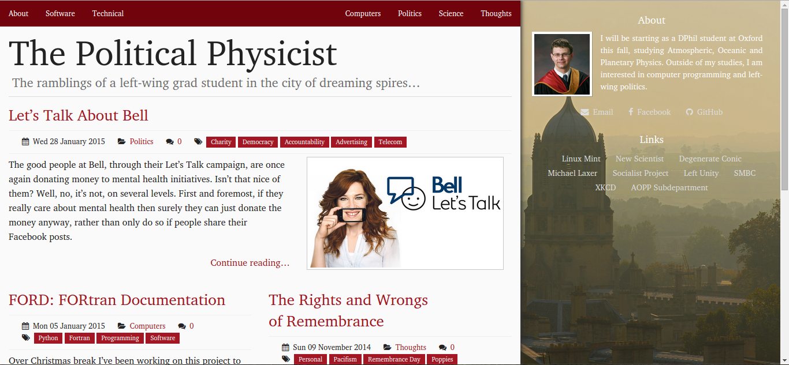
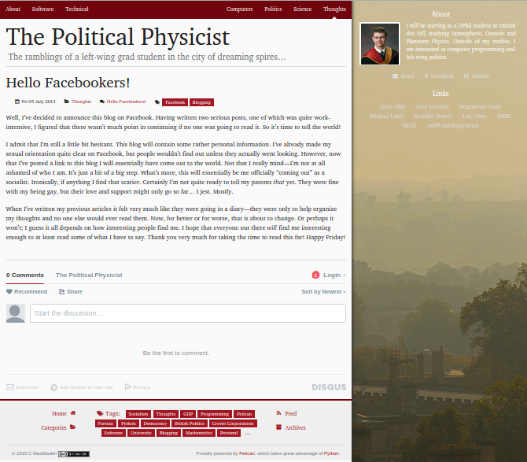
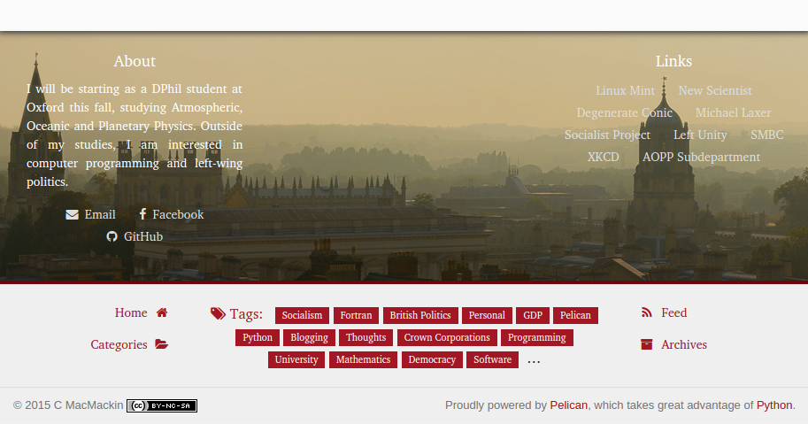

# Backdrop Pelican Theme
Backdrop is a responsive theme which adjusts itself to different screen and
window sizes, built on [Zurb Foundation](http://foundation.zurb.com/).
It is designed to look modern, but at the same time traditional,
using a serif font and darker colours. It features full
[Disqus](https://disqus.com/) integration and can be customized through
variables in your Pelican configuration file. See it live at my blog,
[The Political Physicist](http://cmacmackin.github.io/blog/).

This is an example of the page footer on a medium screen.

I you want to customize Backdrop, perhaps consider using
[Sass](http://sass-lang.com/) and [Grunt](http://gruntjs.com/), as I did when
originally designing it. See the
[backdrop-theme](https://github.com/cmacmackin/backdrop-theme) repository.

## Compatible Plugins
The theme has been designed to use the [representative_image](https://github.com/getpelican/pelican-plugins/tree/master/representative_image) plugin. However,
websites will look fine without it. It is also known to work with the
[render_math](https://github.com/getpelican/pelican-plugins/tree/master/render_math)
and [sitemap](https://github.com/getpelican/pelican-plugins/tree/master/sitemap)
plugins, but these work with all themes and Backdrop is in no way special in
this regard. In future, support may be added for the
[pelican-githubprojects](https://github.com/kura/pelican-githubprojects) and
[tipue_search](https://github.com/getpelican/pelican-plugins/tree/master/tipue_search) plugins.

## Theme Variables
The following variables can be set in your `pelicanconf.py` file in order to
customize your website.

- `SITESUBTITLE`, appears below the SITENAME at the top of the page
- `PROFILE_IMAGE`, the path to a picture of you or your organization to display
  in the sidebar next to any description
- `FAVICON`, the path to a PNG or ICO image to be used as a favicon
- `BACKDROP_IMAGE`, the path to the picture to be displayed in the
  sidebar/bottom-bar
- `SITE_DESCRIPTION`, a few words about you or your website, to be displayed in
  the sidebar next to the profile image
- `LINKS`, a list of tuples (title, URL) for external sites which will appear
  on the sidebar. Can be used as a blogroll
- `DISQUS_URL`, the short [Disqus](https://disqus.com/) sitename, allowing
  Disqus comments to be displayed on your website
- `SOCIAL`, a list of tuples (title, URL) to appear below the PROFILE_IMAGE
  and SITE_DESCRIPTION, linking to social media. The title should be whatever
  you want the text to be in the link, but in order to have an icon it must
  correspond to the name of a
  [Font Awesome](http://fortawesome.github.io/Font-Awesome/icons/#brand)
  icon when converted to lowercase.
- `EMAIL`, displayed alongside SOCIAL
- `YEAR`, the year to appear in the copyright notice. (Hint: `from datetime
  import date`, `YEAR = date.today().year`)
- `TAG_CLOUD_MAX_ITEMS`, the number of tags to display in the footer of the
  website
- `LICENSE`, the license under which to release the websites contents
  (ex: Creative Commons). Write it in HTML in order to use an image and/or link.
- `BLOGKEYWORDS`, a list or tuple of strings containg keywords to be placed
  in the metadata of your website, allowing Google to better categorize it

The paths for FAVICON, PROFILE\_IMAGE, and BACKDROP\_IMAGE can all use the
same `{filename}`/`|filename|` syntax as done when linking between articles.

If your website is paginated, make sure to include the following:
`PAGINATED_DIRECT_TEMPLATES = ('categories', 'archives')`.
