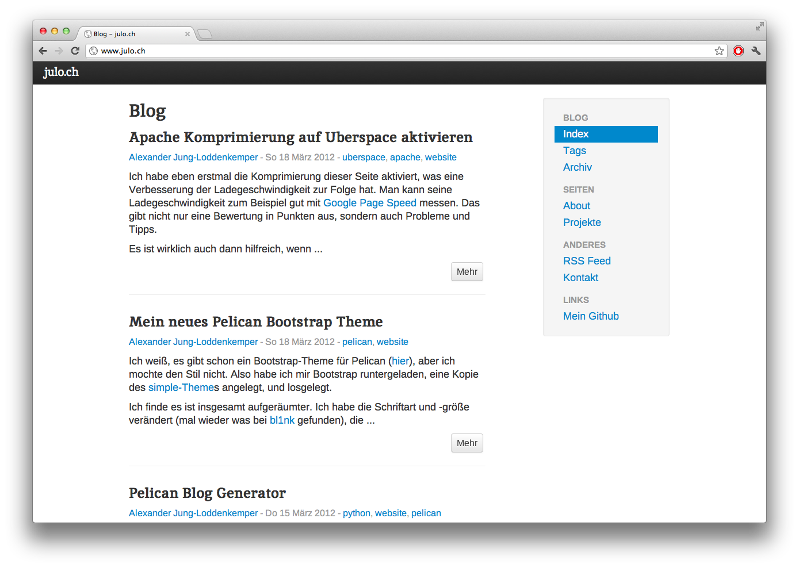

# What is bootlex?

Bootlex is a theme for the [pelican](https://github.com/ametaireau/pelican) static blog generator.
It is based on a modified bootstrap and works nicely with a lot of pelican features.

# Requirements

At some points I switched to the git version, so this theme might work with the stable version, but I recommend to use the latest version from git.

# Installation

Just pull the repo with `git clone git://github.com/alexex/bootlex.git` and include its location via the `THEME` option in your settings.py

There are some settings that will make it work flawlessly:

Your `SITEURL`must have a **trailing slash**. I would recommend the following url config, that I am using with my theme, and seems to work quite good:

	ARTICLE_URL = ('{slug}/')
	ARTICLE_SAVE_AS = ('{slug}.html')
	PAGE_URL = ('{slug}/')
	PAGE_SAVE_AS = ('{slug}.html')
	AUTHOR_URL = ('author/{name}/')
	TAG_URL = ('tag/{name}/')

You will probably need some RewriteRules for your Webserver aswell, my `.htaccess` looks like this:

	RewriteEngine On
	
	RewriteBase /

	RewriteCond %{REQUEST_FILENAME}.html -f
	RewriteRule ^(.+)/$ $1.html [L]
	
# Features

You can make use of the following settings:

* `Pages` (will be included in the menu automatically)
* `MENUITEMS` (will be included aswell)
* `LINKS` (as the above)
* `GOOGLE_ANALYTICS` (will be included automatically, if set)

# Missing

I do not know whether it works, but as I never cared about it, I suppose that categorys will not work properly

## Screenshot ##

