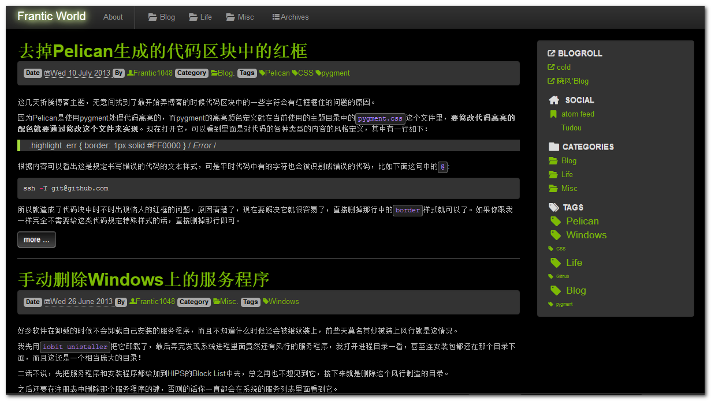

#Bootstrap 2 Dark theme

This theme is forked from [Bootstrap2](https://github.com/getpelican/pelican-themes/tree/master/bootstrap2) theme.

It makes use of [Font-Awesome](http://fortawesome.github.com/Font-Awesome/) icons, supports tag_cloud, translation,
and try to keep other features from Pelican's default theme `notmyidea`.

Here's preview

Feel free to use it.
