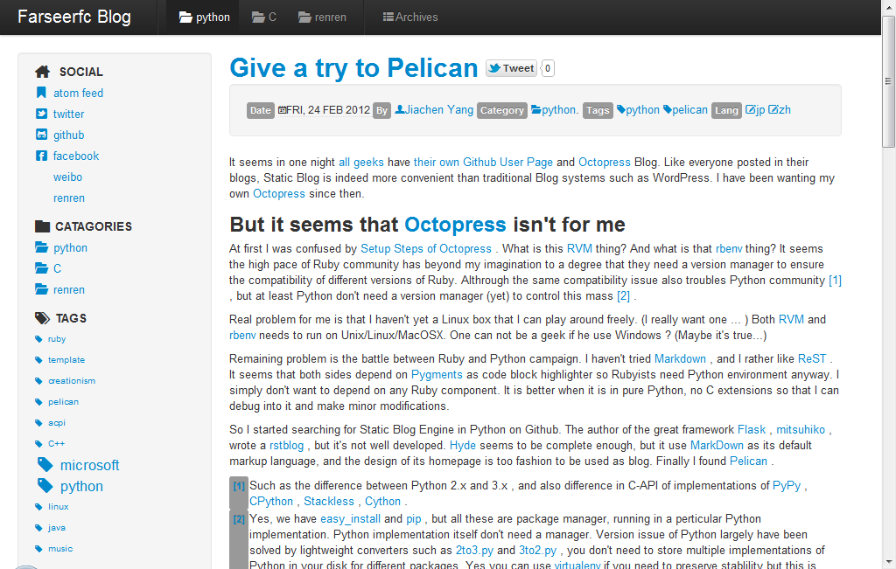

Bootstrap 2 theme
==================

This is (yet another) theme for Pelican inspired by `Twitter Bootstrap 2.0 <http://twitter.github.com/bootstrap/>`_.

It makes use of `Font-Awesome <http://fortawesome.github.com/Font-Awesome/>`_ icons, supports tag_cloud, translation,
and try to keep other features from Pelican's default theme ``notmyidea``.

Also you can see its result from `my Github Page <http://farseerfc.github.com/>`_. It will be updated using latest theme.

Feel free to use it.

Screenshot
----------

