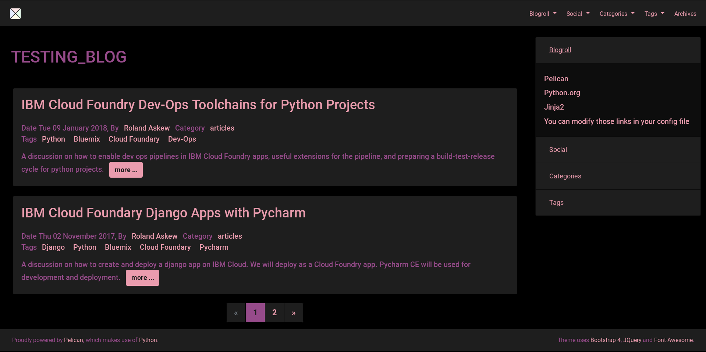
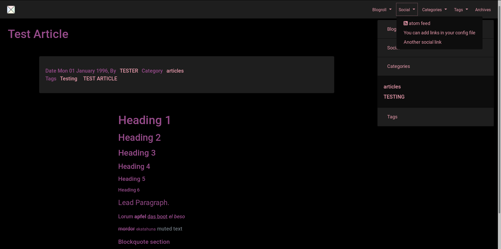

Bootstrap 4 theme (accessible)
============================

A theme for Pelican inspired by `Bootstrap 4 <http://getbootstrap.com/>`_.

Intended for visually impaired users.

Supports `Font-Awesome <http://fortawesome.com/>`_ brand and solid icons.

Free to use, fork and mod to suit your own blog needs.


Acknowledgements and Reuse
--------------------------

To Jiachen Yang <farseerfc@gmail.com>, for the bootstrap2 theme,
upon which this theme is partially based.

Some code reused from the bootstrap2 theme: base, article, page, pagination,
article_infos (changed to metadata), taglist, translations, piwik.


Configuration
-------------

The following additional Pelican configuration variables are available:

=========================== =========
  Variable                  Default
=========================== =========
DISPLAY_BLOGROLL_ON_MENU             False
DISPLAY_SOCIAL_ON_MENU               False
DISPLAY_CATEGORIES_ON_MENU           False
DISPLAY_TAGS_ON_MENU                 False
SIDEBAR			     False
CATEGORIES_SIDEBAR           False
TAGS_SIDEBAR                 False
=========================== =========

MENU variables create dropdowns listing respective blogroll, social menu, categories and tags.
SIDEBAR makes an accordian sidebar appear, by default in the right 4th of the
content area.
Sidebar always contains the Blogroll and Social menu.
Other SIDEBAR variables allow respective lists of categories and tags
to be shown there.


Custom Color Scheme
-------------------------

The color scheme defaults to pink/scarlet on black, with purple-gray and yellow/brown for special cases (such as code tags and warnings) to provide contrast, while being highly visible and friendly to color-blind use cases.

css variables are used to assign colors. The variables are:

```
--color-primary-bright
--color-primary-vhigh
--color-primary-high
--color-primary
--color-primary-low
--color-primary-vlow

--color-links-high
--color-links
--color-links-low

--color-code

--color-warning
--color-success

--bright-black
--mod-black

--table-stripe-accessible
```

You can load a different color scheme with the following setting:

CUSTOM_CSS_COLORS = "path/to/file.css"

Caution: this will *replace* the default color scheme.
Any of the default variables above, not redefined, will have default values.


Custom CSS and Javascript
-------------------------

Use these to tweak the theme as you see fit:

CUSTOM_CSS = "path/to/file.css"

Loads an additional CSS file of your choosing. 

CUSTOM_JS = "path/to/file.js"

Loads an additional Javascript file of your choosing. 


Screenshot
----------




