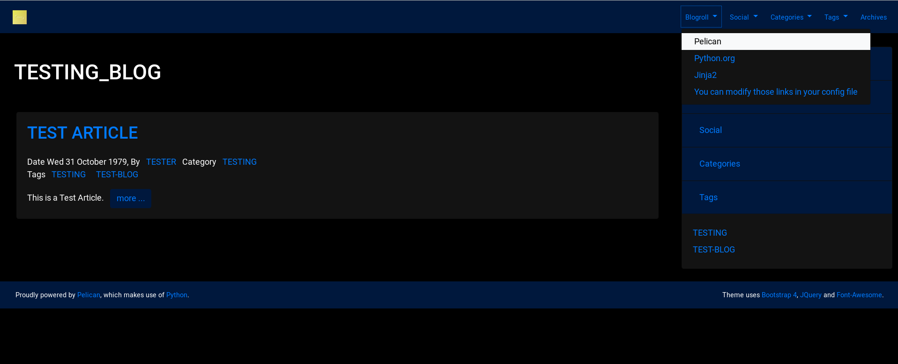

# bootstrap4 #

This was inspired by the [Bootstrap theme](https://github.com/pelican-themes/bootstrap), by [getpelican](https://github.com/getpelican).

Relies on bootstrap, Jquery and dependent libraries, referenced through the bootstrap CDN.

## changelog ##

09/21/2018
- *Updated to Bootstrap 4.1.3.*
- *Changing behaviour to not need as many pelicanconf.py variables, and no custom colours.*

06/10/2018
- *Updated to Bootstrap 4.1.1.*

02/20/2018:
- *Updated to Bootstrap 4.0.0.*

12/20/2017:
- *Added capability to override color scheme.*

12/11/2017:

- *Working when optional settings are missing.*
- *New options to place category, tag, author and blogroll menus in navbar.*
- *Social media now only icons on footer.*

11/29/2017:

- *Check and Test against mock site, preparation for beta.*
- *Test behaviour if new optional settings are missing.*

11/03/2017:

- *Updated to Bootstrap v4.0.0.beta.2.*
- *Moved sidebar to right.*
- *Broke sidebar into sections: blogroll, social media links, and optional authors, categories, and tags.*
- *Archives moved to top navigation menu, far right*
- *no categories, authors or tags pages used, no such pages listed in top navigation menu*
- *Replaced home link in top navigation menu with image link to home page.*
- *added arias for accessibility and screen readers.*
- *added social icons for links referring meetup.com, anaconda.org and instagram.com. Updated reference for del.icio.us*

## features ##

### general ###

- In most cases, the default behaviour of the bootstrap 4 theme has been followed. Differences are in font weight of lead paragraphs, and appearance of nav and metadata links.
- Additionally the theme should be reasonably accessible for the visually impaired and for screen readers.
- if an image `sitebrand.png` is placed in the content/images directory, it will be used as the navbar logo and home button.
- The blogroll and archives are always available in the top menu.
- The blogroll is optionally available in an accordian sidebar, present on the left.
- Categories, Tags and Authors may also be shown in the top menu, and sidebar.
- A limitation is Categories, Tags and Authors must be present in the top menu to also appear in the sidebar.

### optional settings ###

Your pelican settings file may use the following additional settings:

`SITE_DESCRIPTION = 'description of the website'`, for the description meta tag.

`SHOW_AUTHORS = False`, If categories are to be shown or not.
`SHOW_AUTHORS_SIDEBAR = False`, Additionally to the top menu, show a sidebar card listing links for authors of articles.
Note that if all articles only ever have one author, an Author sidebar will never be shown anyway.

`SHOW_CATEGORIES = False`, If categories are to be shown or not.
`SHOW_CATEGORIES_SIDEBAR = False`, Additionally to the top menu, show a sidebar card listing links for categories.

`SHOW_TAGS = False`, If tags are to be shown or not.
`SHOW_TAGS_SIDEBAR = False`, Additionally to the top menu, show a sidebar card listing links for tags.

`SHOW_BLOGROLL_SIDEBAR = False`, Additionally to the top menu, Show a sidebar card listing links for the blogroll.

### additional CSS classes ###

`snippet`, for code blocks (`pre` containing `code`). Adds some margin space top and bottom.
`card-image`, for `card` divs containing a `card-img-top`. Adds some margin space top and bottom.

## Screenshot ##

