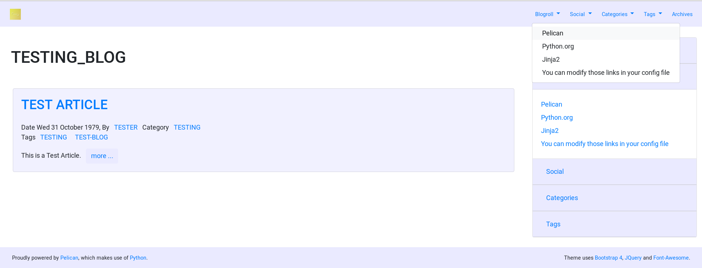
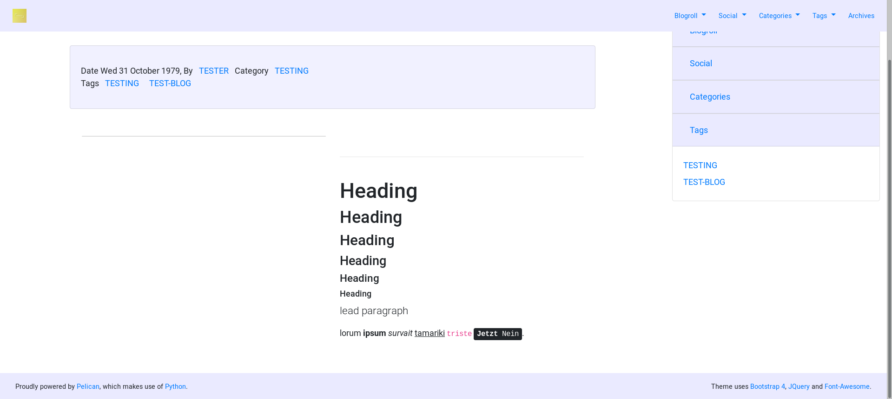

Bootstrap 4 theme (standard)
============================

A theme for Pelican inspired by `Bootstrap 4 <http://getbootstrap.com/>`_.

Supports `Font-Awesome <http://fortawesome.com/>`_ brand and solid icons.

Free to use, fork and mod to suit your own blog needs.

Acknowledgements and Reuse
--------------------------

To Jiachen Yang <farseerfc@gmail.com>, for the bootstrap2 theme,
upon which this theme is partially based.

Some code reused from the bootstrap2 theme: base, article, page, pagination,
article_infos (changed to metadata), taglist, translations, piwik.

Configuration
-------------

The following additional Pelican configuration variables are available:

=========================== =========
  Variable                  Default
=========================== =========
DISPLAY_BLOGROLL_ON_MENU             False
DISPLAY_SOCIAL_ON_MENU               False
DISPLAY_CATEGORIES_ON_MENU           False
DISPLAY_TAGS_ON_MENU                 False
SIDEBAR			     False
CATEGORIES_SIDEBAR           False
TAGS_SIDEBAR                 False
=========================== =========

MENU variables create dropdowns listing respective blogroll, social menu, categories and tags.
SIDEBAR makes an accordian sidebar appear, by default in the right 4th of the
content area.
Sidebar always contains the Blogroll and Social menu.
Other SIDEBAR variables allow respective lists of categories and tags
to be shown there.

Custom CSS
----------

You can add custom CSS without changing the theme, using EXTRA_PATH_METADATA.
The file "custom.css" is looked for by the theme, and will be loaded if exists.

For Example:

EXTRA_PATH_METADATA = {
    'path/to/file.css': {'path': '/theme/static/css/custom.css'},
}

Screenshot
----------

