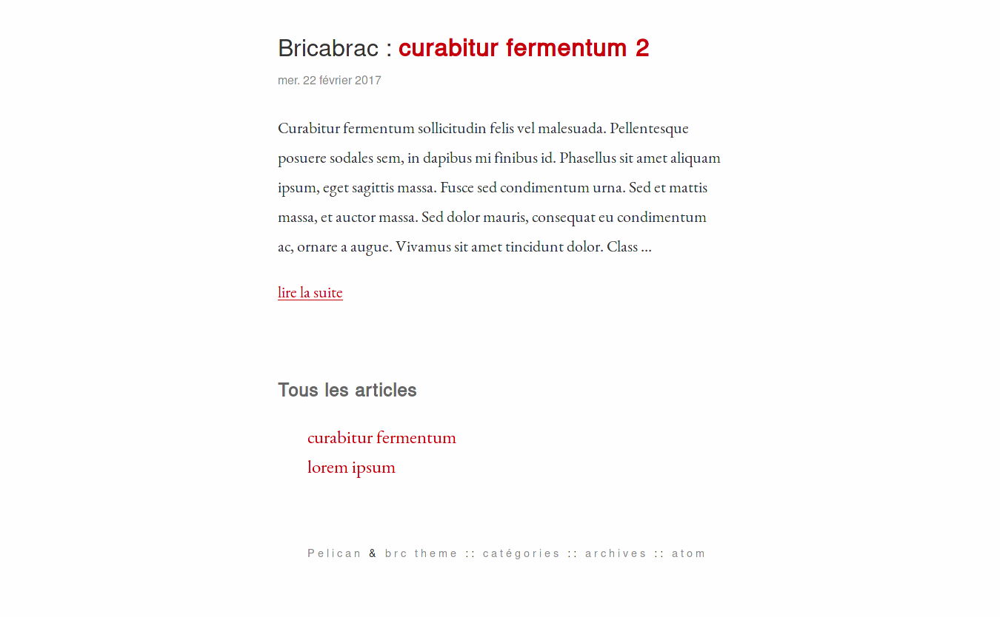
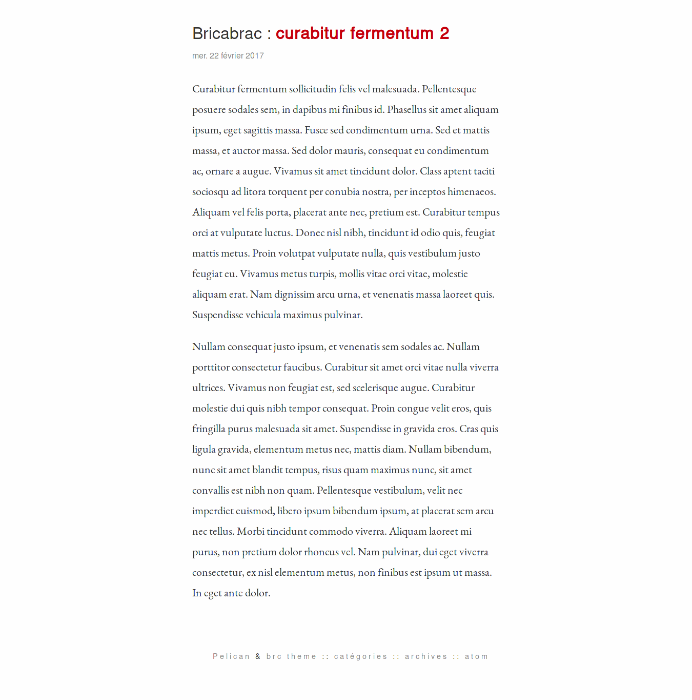
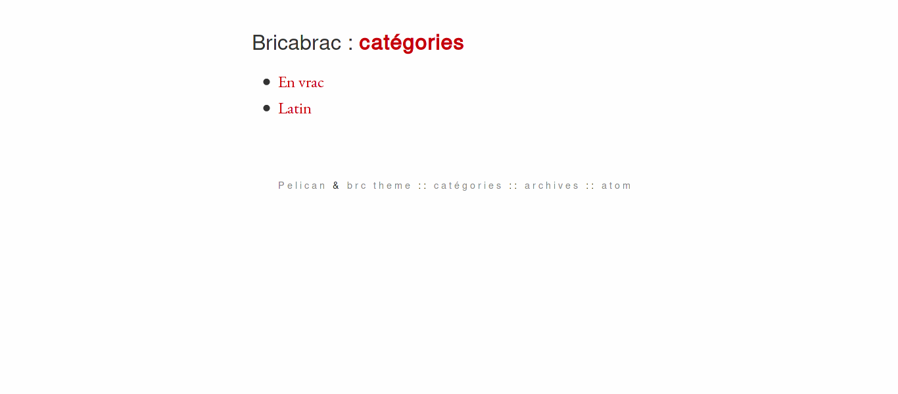
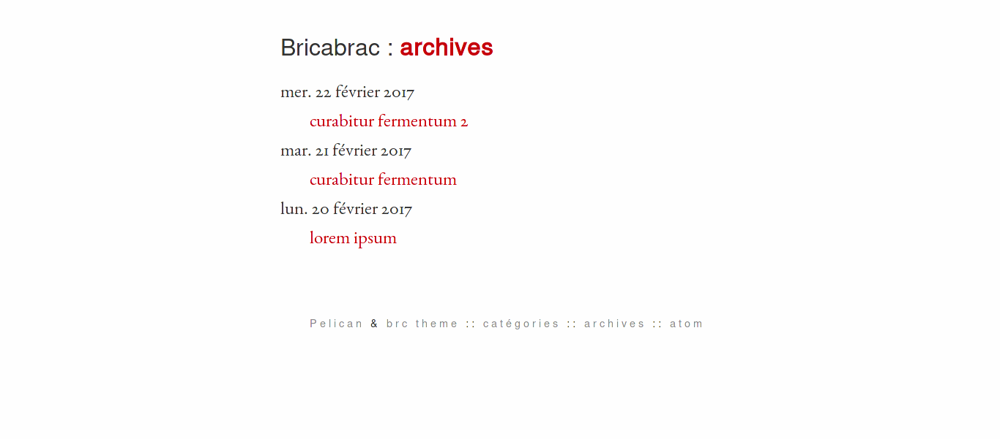

# Bricabrac
## A minimalist Pelican theme
Bricabrac is a minimalist theme for the static site generator [Pelican](https://blog.getpelican.com/).
It is based on the [mnmlist theme](https://github.com/getpelican/pelican-themes/tree/master/mnmlist).

Note: templates include hard-coded French words, you must edit the .html files in order to modify them in the wanted language.

## How-to

To use this theme, just extract the archive and copy the bricabrac theme folder to the `themes` folder in your Pelican site path. Then add the line below to your pelicanconf.py :

    THEME = 'themes/bricabrac-pelican-theme'

## Live demo

You can see a live demo of this theme on my personal web-log : [bricabraque.github.com](https://bricabraque.github.io).

## Screenshots

---

---

---

