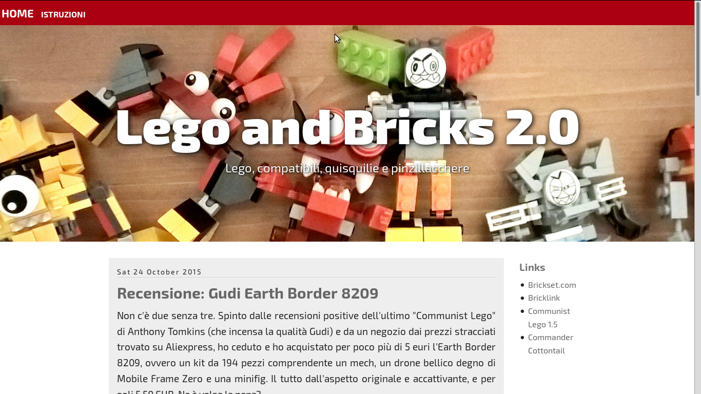

# Bricks theme

This is a responsive theme made for [Pelican](http://www.getpelican.com),
a static site generator.

It is powered by [Zurb Foundation](http://foundation.zurb.com) and uses Exo 2,
a font from Google Fonts.

It's still a work in progress but it is fully functional,
works on all major browsers (Firefox, Chrome, IE, and even unknown ones like
Vivaldi and Midori), and most importantly it works both on mobile and desktop
platforms.  :-)

This theme is named Bricks because I used pelican to convert my Lego blog
from Dotclear (nice but unwieldy) to Pelican (much better, more flexibility).

Here's the screenshot:

## Changes

### SASS

I'm switching to SASS, to provide more options for this layout. You'll
find the source `.scss` file in `static/css` directoty.

### Theme variables

    # if you use Disqus as your comment system:
    DISQUS_SITENAME = 'my_disqus sitename'

    # favicon and icon
    ICONTOUCH = 'bricks_touch.png'
    FAVICON = 'bricks_favicon.png'

    # If you have a trademark text to place at the bottom of your blog:
    TRADEMARK_TEXT = u"""LEGO, the LEGO logo, the Minifigure, 
    and the Brick and Knob configurations  are trademarks 
    of the LEGO Group of Companies. ©2015."""

    # if set, activate the addtoany.com button row. Check
    # article_addsocial.html to customize buttons
    ADD_TO_SOCIAL =  True

# Licence

This theme is published under the WTF Licence, which states:

    WHAT THE FUCK YOU WANT TO PUBLIC LICENSE
    Version 2, December 2004

    Copyright (C) 2004 Sam Hocevar <sam@hocevar.net>

    Everyone is permitted to copy and distribute verbatim or modified
    copies of this license document, and changing it is allowed as long
    as the name is changed.

    DO WHAT THE FUCK YOU WANT TO PUBLIC LICENSE
    TERMS AND CONDITIONS FOR COPYING, DISTRIBUTION AND MODIFICATION

    0. You just DO WHAT THE FUCK YOU WANT TO.

However, should you use this theme as a basis for a
commercial endeavour, please give me credit.  :-)
