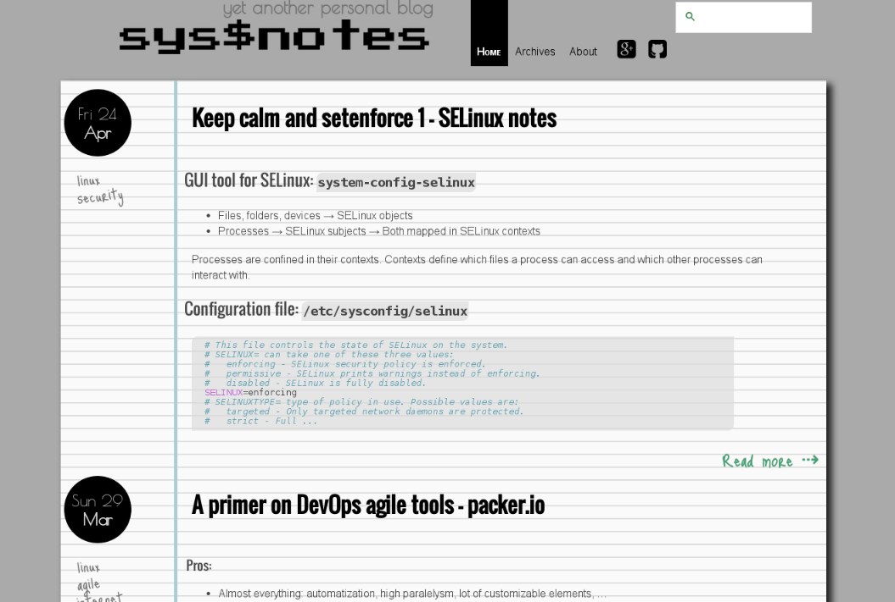
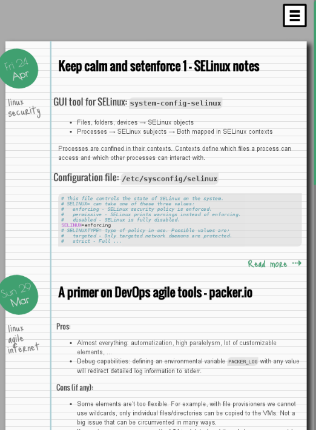

#Calepin theme for Pelican 3.5.0

Calepin is a notebook-like theme for [Pelican](https://github.com/getpelican/pelican),
powered by [Bootstrap](http://getbootstrap.com) and 
[FontAwesome icons](http://fortawesome.github.io/Font-Awesome/).

#Requirements
- [Pelican](https://github.com/getpelican/pelican)

#Optional
- Tipuesearch plugin

#Configuration items

Customizable items in `pelicanconf.py`:

- `SOCIAL_SQUARE_ICONS` = True|False

    When using a `SOCIAL` list of tuples (as described for `notmyidea` theme
    in [pelican docs](http://docs.getpelican.com/en/latest/settings.html)) this
    setting defines whether or not the icons are themed square or normal as
    per [Font Awesome](http://fortawesome.github.io/Font-Awesome/icons/).

> The first element of the SOCIAL tuple **must** match the name of the icon
> (see [Font Awesome](http://fortawesome.github.io/Font-Awesome/icons/)).
>
> **Example**:
>
>     SOCIAL = (('twitter', 'http://twitter.com/yourtwtrID'),
>               ('lastfm', 'http://lastfm.com/user/yourlastfmID'),
>               ('google-plus', 'https://plus.google.com/+yourGooglePlusID'))

- `ABOUT_URL` = 'http://a_valid_url_here'

    Meant to link towards an `about.me` page. Hidden if omitted.

- `DISQUS`

    If `DISQUS_SITENAME` is set, a post-it note like section is shown
    at the end of each article.

- `LICENSE` - Set the license type in the footer.

- `USE_FAVICON` = True|False

    Whether or not include a `favicon.ico` that should be placed under
    `theme/images`

- `SITELOGO` - If found under `theme/images`, use this instead of the title

- `PLUGINS`

   `tipue_search` - If enabled, a searchbox is set at the top right.

#Screenshot

**Responsive mode:**

#Live example

Check [my blog](http://fernandezcuesta.github.io) for a live demo.

