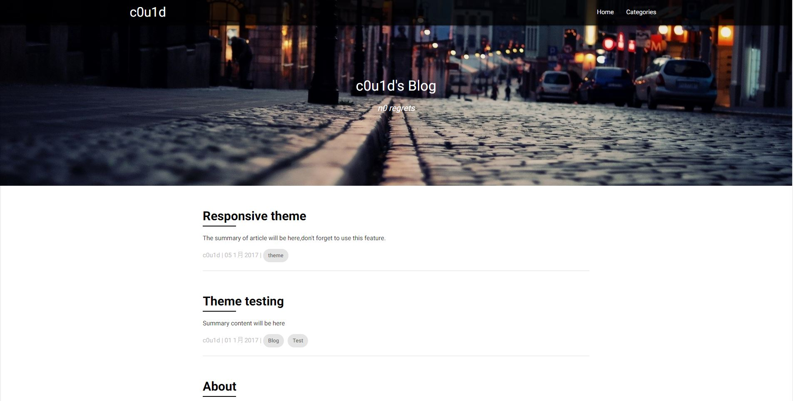
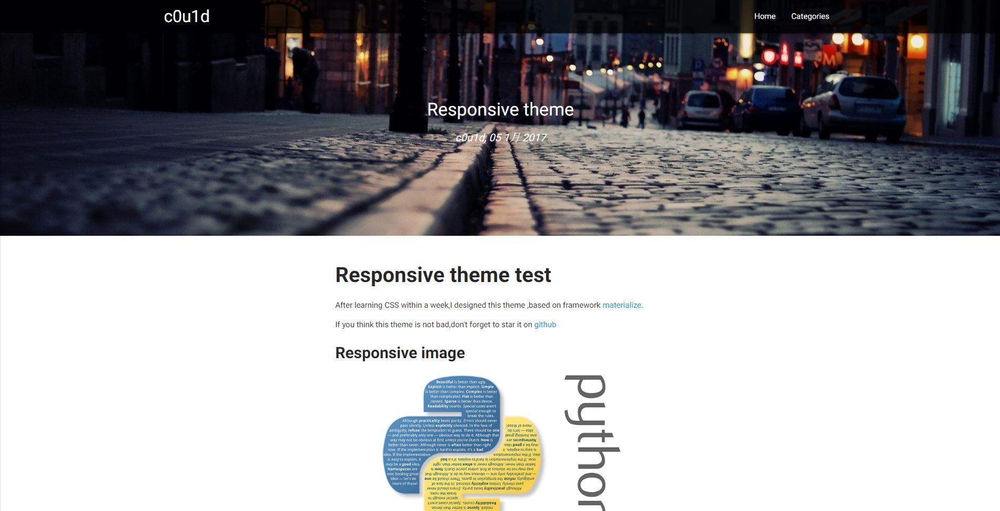
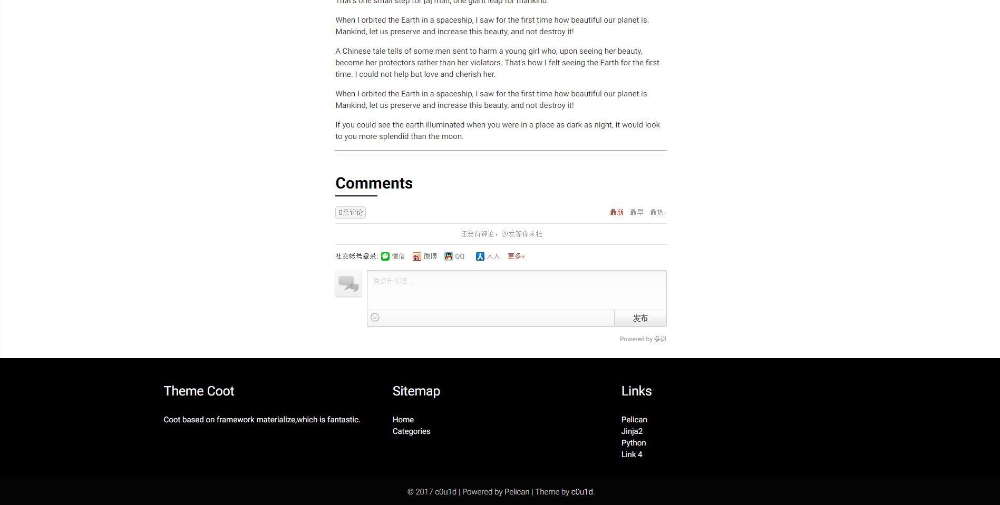
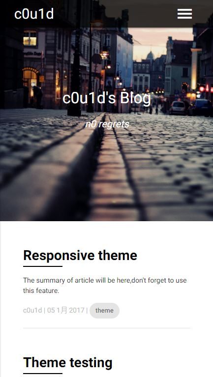

##Coot
Coot is a theme for [Pelican](http://getpelican.com/),a static site generator written in Python.

[Demo](http://c0u1d.lol)

##Screenshots

##Configuration
Index background image should be located in content/images directory,and don't forget to configure `COOT_HEADER_IMAGES`
just in `pelicanconf.py`

Add a article background image by adding Background custom parameter in your markdown article or page. Image should be located in content/images directory.

Example:

    Title: Article Title
    Date: 2017-1-1
    Category: blog
    Tags: blog
    Slug: article-slug
    Author: c0u1d
    Background: background.jpg

more configuration detail see file [pelicanconf.py](https://raw.githubusercontent.com/c0u1d/pelican-themes/master/coot/pelicanconf.py)

	

