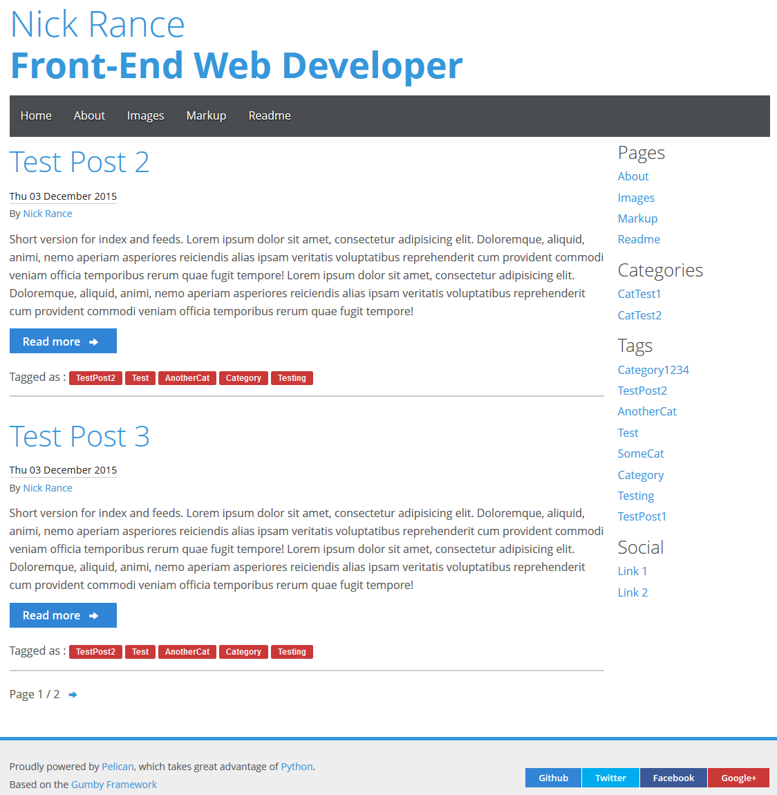

### What is Gum?

Gum is a clean and responsive theme for [Pelican](https://github.com/getpelican/pelican), based on the [Gumby Framework](http://gumbyframework.com/docs).

### Requirements

* [Pelican](https://github.com/getpelican/pelican)

### Configuration

* Edit your settings file to include the following if desired (any values left blank won't show up in the theme):

```
GITHUB_URL = ''
TWITTER_URL = ''
FACEBOOK_URL = ''
GOOGLEPLUS_URL = ''
```

This theme uses the latest Google Analytics code, which will be included when the following values are filled out appropriately.

```
GOOGLE_ANALYTICS_ID = ''
GOOGLE_ANALYTICS_SITENAME = ''
```

Alternatively you can use [Piwik](http://piwik.org/) for analytics if you set the following settings, where the url has to be given without leading `http://` and trailing `/`.

```
PIWIK_ID = ''
PIWIK_URL = ''
```

To use Juvia for comments, fill out the following values, again the url without leading `http://` and trailing `/`.

```
JUVIA_URL = ''
JUVIA_ID = ''
```

### Screenshot ###



### Credits / Thanks

 * Alexis Metaireau / Pelican
 * Digital Surgeons / Gumby Framework
 * Twitter Bootstrap
 * traeblain for his [makefile](https://gist.github.com/traeblain/4252511) gist for building Pelican on Windows

**MIT Open Source License**

Permission is hereby granted, free of charge, to any person obtaining a copy of this software and associated documentation files (the "Software"), to deal in the Software without restriction, including without limitation the rights to use, copy, modify, merge, publish, distribute, sublicense, and/or sell copies of the Software, and to permit persons to whom the Software is furnished to do so, subject to the following conditions:

The above copyright notice and this permission notice shall be included in all copies or substantial portions of the Software.

THE SOFTWARE IS PROVIDED "AS IS", WITHOUT WARRANTY OF ANY KIND, EXPRESS OR IMPLIED, INCLUDING BUT NOT LIMITED TO THE WARRANTIES OF MERCHANTABILITY, FITNESS FOR A PARTICULAR PURPOSE AND NONINFRINGEMENT. IN NO EVENT SHALL THE AUTHORS OR COPYRIGHT HOLDERS BE LIABLE FOR ANY CLAIM, DAMAGES OR OTHER LIABILITY, WHETHER IN AN ACTION OF CONTRACT, TORT OR OTHERWISE, ARISING FROM, OUT OF OR IN CONNECTION WITH THE SOFTWARE OR THE USE OR OTHER DEALINGS IN THE SOFTWARE.
