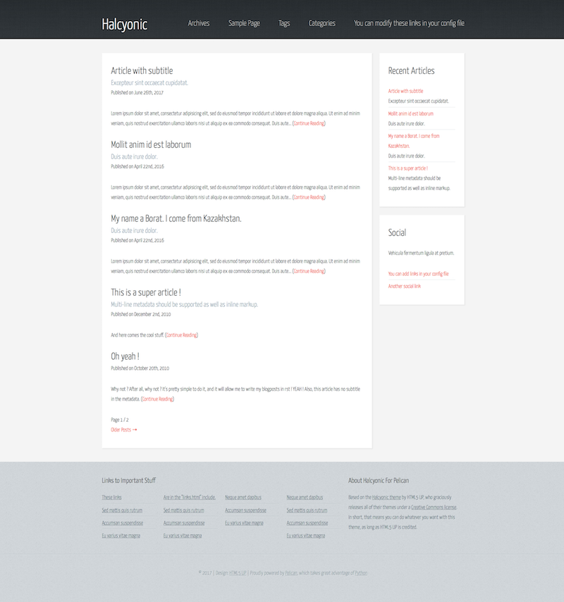
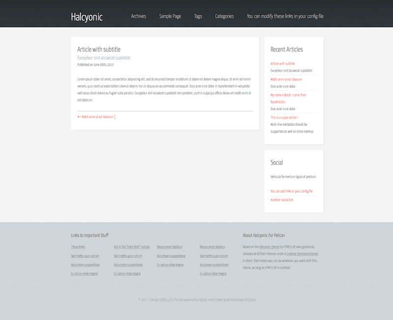
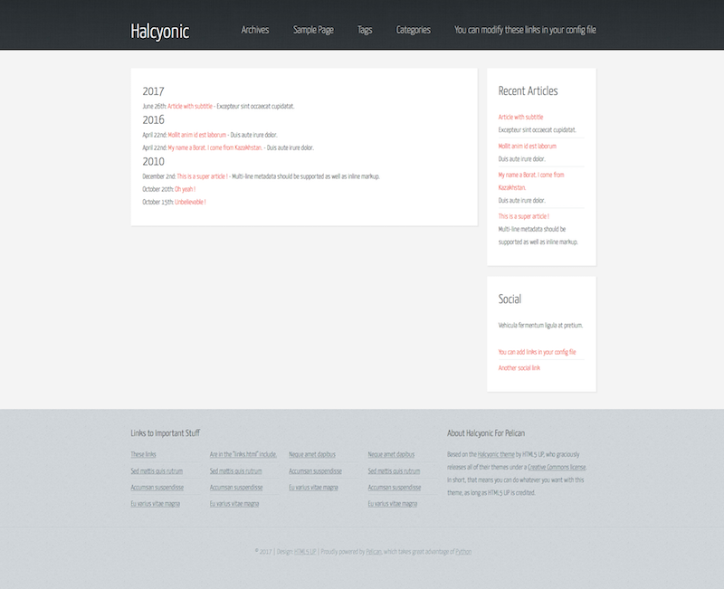

# Halcyonic - An [HTML5 UP](http://html5up.net) theme for Pelican

Halcyon for [Pelican][1] is a clean, simple theme based on the 2-column layout (sidebars on the right) of the HTML5 Up theme of [the same name][2].  
Creation of the theme was another exercise in learning to create themes totally from scratch.  
As such, I made the theme (mostly) modular, so that pretty much any section of the theme can be easily edited (*or removed from the layout entirely*).  
The top navigation menu, social links are configured in `pelicanconf.py` as is the norm.  
The footer (*and the links and blurb therein*) are simple includes and can be edited separately or removed from the layout.  

Google Analytics is enabled by uncommenting and editing the ID in pelicanconf.py.  

The '[Neighbors][3]' plugin is needed.  

Something that seems to be unique (or at the very least, *uncommon*) to my themes/modification of themes is that the dates are English Ordinal (e.g., "June 1st, 2017").  
For that to work (aside from what's already in the sample pelicanconf.py) you'll need the python package "[inflect][4]" and to creat a jinja filter.  
The sample pelicanconf.py has the necessary code to enable it. 

Create a folder named "`utils`" in the root of your site directory:   

```
├─ static  
├─ templates  
└─ utils  
    └─ filters.py
```  


Add the following code to "`filters.py`":  

```python
#!/usr/bin/env python

def ordinal(self):
    o = inflect.engine()
    return o.ordinal(self)  # 1 -> '1st'
```

## Posts

### ReStructuredText
```rst
What's that sound? Doves?
#########################
:subtitle: a subtitle
:date: 1999-12-31
:tags: pelican, party
:category: Purple

Two thousand zero zero
```

### Markdown
```markdown
---
title: It's raining pelicans
date: 1999-12-31
tags: pelican, party
category: Purple
---

Party's not over yet, even without a subtitle
```

## Screenshots

### Main


### Single Article


### Archives



#### Original README
Halcyonic by HTML5 UP
html5up.net | @ajlkn
Free for personal and commercial use under the CCA 3.0 license (html5up.net/license)


A somewhat unusual but interesting responsive site template. I did this one to test out a
new pattern set I put together and I think it really came together well. As for use cases
it's kind of unspecific so hey, use it for whatever.

Feedback, bug reports, and comments are not only welcome, but strongly encouraged :)

AJ
aj@lkn.io | @ajlkn


Credits:

    Demo Images:
        Unsplash (unsplash.com)

    Other:
        jQuery (jquery.com)
        html5shiv.js (@afarkas @jdalton @jon_neal @rem)
        Respond.js (j.mp/respondjs)
        Skel (skel.io)
        

[1]: https://getpelican.com "Pelican"
[2]: https://html5up.net/halcyonic
[3]: https://github.com/getpelican/pelican-plugins/tree/master/neighbors
[4]: https://pypi.python.org/pypi/inflect/