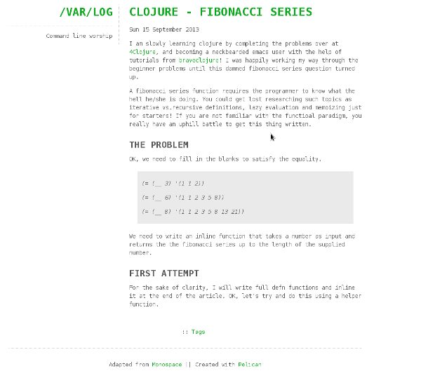

Monospace
==========

Theme adapted from [Monospace for Wordpress](http://wordpress.org/themes/monospace)
Here is a screenshot for your viewing pleasure:

If you are using Markdown, you need to include the following option in your settings file to enable syntax highlighting.

    MD_EXTENSIONS = ['codehilite(css_class=codehilite code)']

Also, you might want to include the `DESCRIPTION` option (it appears in the left sidebar):

    DESCRIPTION = 'My blog and stuff ...'

Nice and simple,
Enjoy!
