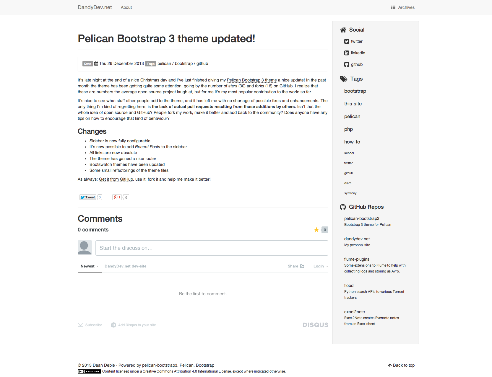

# pelican-bootstrap3

This is a Bootstrap 3 theme for Pelican. It's fully responsive. Bootstrap 3 has seen an official, final release now, so
I don't expect any breaking changes anymore. I will try to keep it up-to-date.

## CONTRIBUTING

If you want to adjust this theme to your own liking, I encourage you to fork it. This theme has started to gather more
and more attention in the form of stars and forks. If you make improvements that are useful to others and can make the
theme better in general **please don't hesitate to make a pull request**. For contributing guidelines, [look here](CONTRIBUTING.md)

## Installation

First:

`git clone https://github.com/DandyDev/pelican-bootstrap3.git`

Then:

Point the `THEME` variable in your `pelicanconf.py` to `/path/to/pelican-bootstrap3`

## Usage

This theme honors the following standard Pelican settings:

* Putting feeds in the `<head>` section:
	* `FEED_ALL_ATOM`
	* `FEED_ALL_RSS`
* Template settings:
	* `DISPLAY_PAGES_ON_MENU`
	* `DISPLAY_CATEGORIES_ON_MENU`
	* `MENUITEMS`
	* `LINKS` (Blogroll will be put in the sidebar instead of the head)
* Analytics & Comments
	* `GOOGLE_ANALYTICS`
	* `DISQUS_SITENAME`
	* `PIWIK_URL`, `PIWIK_SSL_URL` and `PIWIK_SITE_ID`

It uses the `tag_cloud` variable for displaying tags in the sidebar. You can control the amount of tags shown with: `TAG_CLOUD_MAX_ITEMS`

## Extras

### Custom CSS

If you want to add custom css to the theme, without having to clone and maintain your own version of the theme, you can use the `CUSTOM_CSS` variable. The value is the location where you tell Pelican to put the file (see below):

```
CUSTOM_CSS = 'static/custom.css'
```

To tell Pelican to copy the relevant file to the desired destination, add the path to `STATIC_PATHS` and the destination to `EXTRA_PATH_METADATA`, like so:

```
# Tell Pelican to add 'extra/custom.css' to the output dir
STATIC_PATHS = ['images', 'extra/custom.css']

# Tell Pelican to change the path to 'static/custom.css' in the output dir
EXTRA_PATH_METADATA = {
    'extra/custom.css': {'path': 'static/custom.css'}
}
```

### Pygments

You can choose the syntax highlighting style by using the `PYGMENTS_STYLE` variable to specify one of the built-in Pygments styles. By default the `native` style is used. The following styles are avaiable:

- autumn
- borland
- bw
- colorful
- default
- emacs
- friendly
- fruity
- manni
- monokai
- murphy
- native
- pastie
- perldoc
- solarizeddark
- solarizedlight
- tango
- trac
- vim
- vs

For a demo of the different Pygment styles, have a look [here](http://pygments.org/demo/218030/)

### Site Brand

You can provide a logo for your site using `SITELOGO`. For example: `SITELOGO = 'images/my_site_logo.png'`. You can then define the size of the logo using `SITELOGO_SIZE`. The `width` of the `` element will be set accordingly.

By default the `SITENAME` will be shown as well. It's also possible to hide the site name using the `HIDE_SITENAME` flag.

### Breadcrumbs

It's possible to show breadcrumbs in your site using the `DISPLAY_BREADCRUMBS` flag. By default the article category isn't shown in the breadcrumbs, if you wish to enable it, set the `DISPLAY_CATEGORY_IN_BREADCRUMBS` flag to _True_.

### Navbar

If you wish to use the inverse navbar from Bootstrap, set the flag `BOOTSTRAP_NAVBAR_INVERSE` to _True_.

### Related Posts

This theme has support for the [Related Posts plugin](https://github.com/getpelican/pelican-plugins/tree/master/related_posts). All you have to do, is enable the plugin, and the theme will do the rest.

### Favicon

Set the `FAVICON` option in your `pelicanconf.py`. For example: `FAVICON = 'images/favicon.png'`

### Sidebar options

The following things can be displayed on the sidebar:

* **Social links** can be provided through the `SOCIAL` variable. If it's empty, the section will not be shown
	* In your `pelicanconf.py` provide your social links like this:

```
SOCIAL = (('twitter', 'http://twitter.com/DaanDebie'),
          ('linkedin', 'http://www.linkedin.com/in/danieldebie'),
          ('github', 'http://github.com/DandyDev'),)
```
* **Tags** will be shown if `DISPLAY_TAGS_ON_SIDEBAR` is set to _True_
* **Categories** will be shown if `DISPLAY_CATEGORIES_ON_SIDEBAR` is set to _True_
* **Recent Posts** will be shown if `DISPLAY_RECENT_POSTS_ON_SIDEBAR` is set to _True_
	* Use `RECENT_POST_COUNT` to control the amount of recent posts. Defaults to **5**

To remove the sidebar entirely, set `HIDE_SIDEBAR` to _True_.

### reStructuredText styles

If you're using reStructuredText for writing articles and pages, you can include the extra CSS styles that are used by the `docutils`-generated HTML by setting `DOCUTIL_CSS` to True. This can be done as a global setting or  setting it in the metadata of a specific article or page.

### Disqus comments

* This theme sets identifiers for each article's comment threads. If you are switching from a theme that doesn't (such as the Pelican built-in default) this will result in existing comments getting lost. To prevent this, set DISQUS_NO_ID to _True_.
* Set DISQUS_ID_PREFIX_SLUG to _True_ if you have configured your article URLs such that the slug alone will likely not be unique. Ignored if DISQUS_NO_ID is _True_.
* To show Disqus comment counts on the index page, set DISQUS_DISPLAY_COUNTS to _True_.

### Content license

You can optionally declare a [Creative Commons license](http://creativecommons.org) for the content of your site. It will appear in the site's footer. To enable, use one of the following two ways for configuration.

* To choose the license by name, set `CC_LICENSE` to the common abbreviated name of the license: `"CC-BY"` (require attribution), `"CC-BY-SA"` (require ShareAlike), `"CC-BY-ND"` (NoDerivatives) , `"CC-BY-NC"` (require attribution, no commercial reuse), `"CC-BY-NC-SA"` (require ShareAlike, no commercial reuse), or `"CC-BY-NC-ND"` (NoDerivatives, no commercial reuse).
* Alternatively, choose the licence by features:
    * `CC_LICENSE_DERIVATIVES` - `"yes"` if permitted, `"no"` if not permitted, and `"ShareAlike"` if derivatives must be shared under the same terms.
    * `CC_LICENSE_COMMERCIAL` - `"yes"` if commercial reuse is permitted, and `"no"` otherwise. 
* Optionally, you can include attribution markup in the license mark by setting `CC_ATTR_MARKUP` to _True_.

The license choice mirrors the [Creative Commons License Chooser](http://creativecommons.org/choose/). Source for the macro that renders the mark is at http://github.com/hlapp/cc-tools.

### GitHub

The theme can show your most recently active GitHub repos in the sidebar. To enable, provide a `GITHUB_USER`. Appearance and behaviour can be controlled using the following variables:

* `GITHUB_REPO_COUNT`
* `GITHUB_SKIP_FORK`
* `GITHUB_SHOW_USER_LINK`

### Bootswatch and other Bootstrap 3 themes

I included all the lovely Bootstrap 3 themes from [Bootswatch](http://bootswatch.com/), built by [Thomas Park](https://github.com/thomaspark). You can tell Pelican what Bootswatch theme to use, by setting `BOOTSTRAP_THEME` to the desired theme, in lowercase (ie. 'readable' or 'cosmo' etc.). My own site is using _Readable_. If you want to use any other Bootstrap 3 compatible theme, just put the minified CSS in the `static/css` directory and rename it using the following naming scheme: `bootstrap.{theme-name}.min.css`. Then update the `BOOTSTRAP_THEME` variable with the _theme-name_ used.

#### Update: Readable has seen some major changes. I added the new version as 'readable' and renamed the old version to 'readable-old'. Update your config accordingly.

### AddThis

You can enable sharing buttons through [AddThis](http://www.addthis.com/) by setting `ADDTHIS_PROFILE` to your AddThis profile-id. This will display a **Tweet**, **Facebook Like** and **Google +1** button under each post.

### Facebook Open Graph

In order to make the Facebook like button work better, the template contains Open Graph metatags like `<meta property="og:type" content="article"/>`. You can disable them by setting `USE_OPEN_GRAPH` to _False_. You can use `OPEN_GRAPH_FB_APP_ID` to provide a Facebook _app id_. You can also provide a default image that will be passed to Facebook for the homepage of you site by setting `OPEN_GRAPH_IMAGE` to a relative file path, which will be prefixed by your site's static directory.

### Footer

The footer will display a copyright message using the AUTHOR variable and the year of the latest post. If a content license mark is enabled (see above), that will be shown as well. 

## Screenshot




## Live example

[This is my website](http://dandydev.net)
