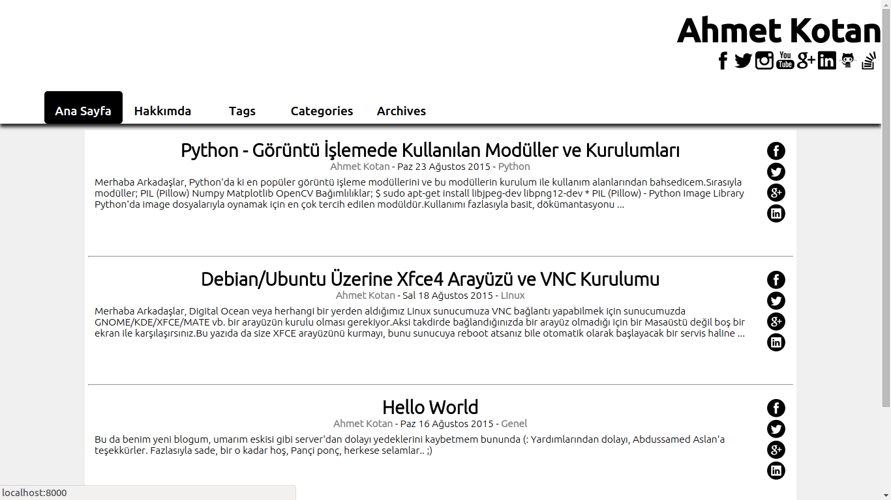
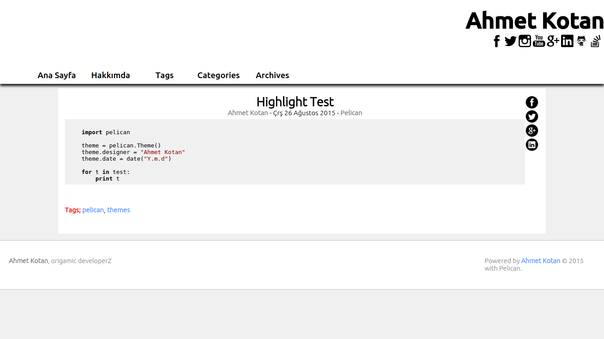

##pelican-dark
A theme for the [Pelican](http://getpelican.com) static site generator.
Designer: [Ahmet Kotan](http://ahmetkotan.com.tr)

* Social Media Buttons
* Social Networks Share Buttons for Article and Pages
* Highlighting Code

## Installation
git clone git@github.com:ahmetkotan/pelican-dark.git

## Usage
Pelican [documentation](http://docs.getpelican.com/en/latest/)

### Theme Options
| Config                    | Type       | Description               |
| ------------------------- | ---------- | ------------------------- |
| SITEDESC        			| TEXT       | Homepage Title            |
| PAGES_ON_MENU				| BOOL		 | Pages on the menu		 |
| TAGS_VISIBLE				| BOOL		 | Tag link in Menu			 |
| CAT_VISIBLE				| BOOL		 | Category link in Menu	 |
| ARCHIVES_VISIBLE			| BOOL		 | Archives link in Menu	 |
| SOCIAL_ON_PAGE			| BOOL		 | Social Button on Page	 |
| SOCIAL_ON_ARCHIVES		| BOOL		 | Social Button on Archives |

| Config                    | Type       | Description               |
| ------------------------- | ---------- | ------------------------- |
| DISQUS_SITENAME			| TEXT		 | Disqus					 |
| GOOGLE_ANALYTICS			| TEXT 		 | Google Analytic 			 |

####Social
| Config                    | Type       | Description               |
| ------------------------- | ---------- | ------------------------- |
| FB_ADD					| TEXT		 | Facebook					 |
| TWITTER_ADD				| TEXT		 | Twitter					 |
| INSTAGRAM_ADD				| TEXT		 | Instagram				 |
| YOUTUBE_ADD				| TEXT		 | YouTube					 |
| GOOGLE_ADD				| TEXT		 | Google Plus				 |
| LINKEDIN_ADD				| TEXT		 | Linkedin					 |
| GITHUB_ADD				| TEXT		 | Github					 |
| STACK_ADD					| TEXT		 | Stack Overflow			 |

## Demo
[ahmetkotan.com.tr](http://ahmetkotan.com.tr)

## Screenshots

