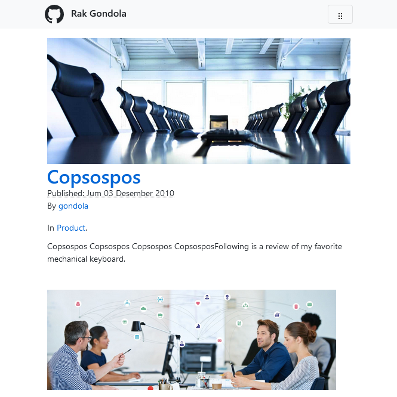

# Peliciando

A blast fast modern with SEO for phyton pelican template

Test drive demo [https://rakgondola.web.app/ →](https://rakgondola.web.app/)

Documentation [https://www.hockeycomputindo.com/2022/03/new-pelician-template-pecliando-phyton.html →](https://www.hockeycomputindo.com/2022/03/new-pelician-template-pecliando-phyton.html)

------------------------------------

Recipes :
+ Phyton
+ GetPelican
+ Bootstrap
+ Primer
+ Axcora

Features: 
+ Blog
+ Markdown
+ Auto SEO

--------------------------------------

### DISPLAY

Home page with article list

Other page with image

Mobile display

------------------------

Test drive demo [https://rakgondola.web.app/ →](https://rakgondola.web.app/)

Documentation [https://www.hockeycomputindo.com/2022/03/new-pelician-template-pecliando-phyton.html →](https://www.hockeycomputindo.com/2022/03/new-pelician-template-pecliando-phyton.html)

-------------------------------

WORK :
+ create venv on pelican project
+ download source code pelicando
+ open venv\Lib\site-packages\pelican\themes
+ upload peliciando to themes folder
+ open pelicanconf.py
+ insert THEME = 'pelicianido' on pelicanconf.py
+ or open pelicanconf.py from peliciando and copy to project/pelicanconf.py

