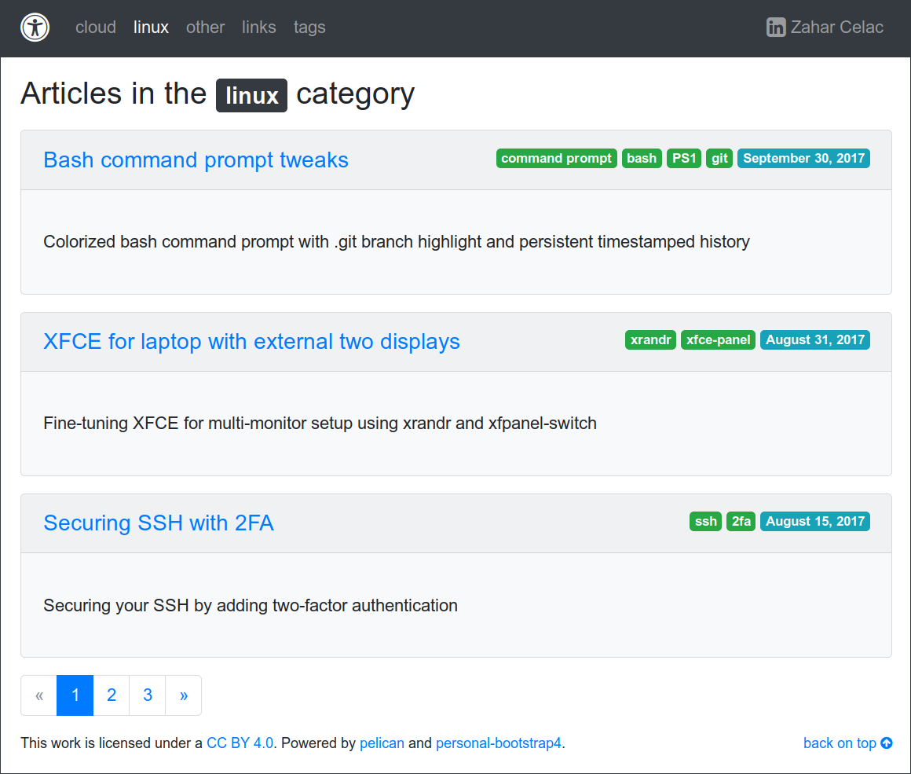
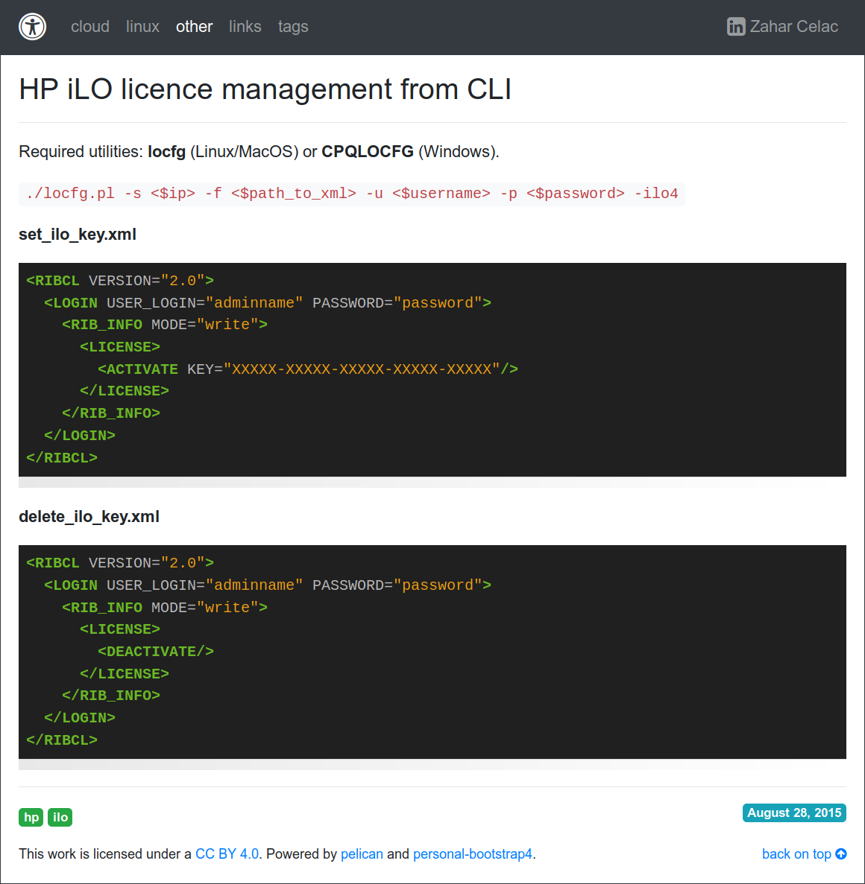
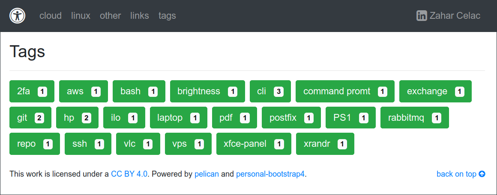
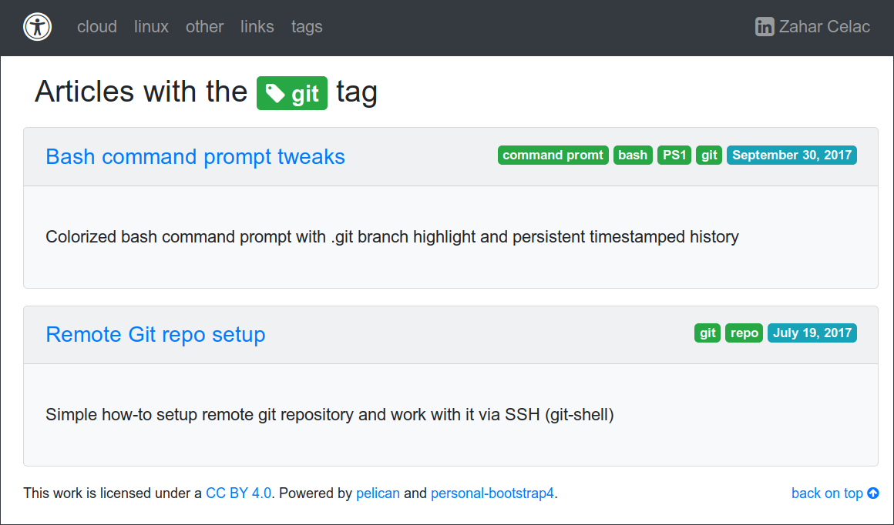
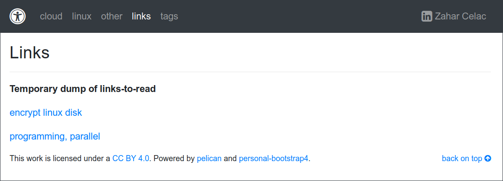

### DESCRIPTION

Very basic [Pelican](https://github.com/getpelican/pelican) theme I created to get handy access to my [Markdown](https://daringfireball.net/projects/markdown/) notes.

### SCREENSHOTS











### REQUIREMENTS

This theme is based on [Bootstrap 4](https://getbootstrap.com/), [Font Awesome Icons](http://fontawesome.io/) and [jQuery](https://jquery.com/).

See below how complete project tree looks like, to understand where to place downloaded static assets (marked with ***), and how everything corresponds with provided sample `pelicanconf.py` configuration.

```
├── content
│   ├── category_A
│   │   ├── article_1.md
│   │   └── article_2.md
│   ├── category_B
│   │   └── article_3.md
│   └── pages
│       ├── page_x.md
│       └── page_y.md
├── output
│   └── <...>
├── pelicanconf.py
└── theme
    ├── static
    │   ├── css
    │   │   ├── bootstrap.min.css ***
    │   │   ├── font-awesome.min.css ***
    │   │   ├── fixes.css
    │   │   └── pygments.css
    │   ├── fonts
    │   │   ├── FontAwesome.otf ***
    │   │   ├── fontawesome-webfont.eot ***
    │   │   ├── fontawesome-webfont.svg ***
    │   │   ├── fontawesome-webfont.ttf ***
    │   │   ├── fontawesome-webfont.woff ***
    │   │   └── fontawesome-webfont.woff2 ***
    │   ├── img
    │   │   └── favicon.png
    │   └── js
    │       ├── bootstrap.bundle.min.js ***
    │       └── jquery.min.js ***
    └── templates
        ├── article.html
        ├── base.html
        ├── category.html
        ├── index.html
        ├── page.html
        ├── tag.html
        └── tags.html
```

Versions at the moment of theme creation were as follows:

- Bootstrap 4.0.0.beta2
- Font Awesome Icons 4.7.0
- jQuery 3.2.1

### LICENSE

[CC-BY-4.0](https://creativecommons.org/licenses/by/4.0/)