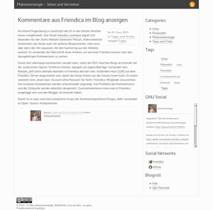

## simplegrey-free#

## Screenshot ##

## Options ##

Theme inspired by pelican-simplegrey, but without all the datadealer (Google, Twitter, Facebook) stuff. GNU Social Widget in sidebar. Comments from Friendica server are shown. Social links to Friendica, Diaspora, Statusnet,... EMail and License is displayed in the footer.

Javascript only used for GNU Social/StatusNet Widget and Friendica Comments.

Configuration in pelicanconf.py:

    EMAIL='x@y.com'
    FRIENDICA_COMMENTS = 'http://example.com'
    # Use web address of your own server
    SOCIAL = (('Buddycloud', 'https://demo.buddycloud.org/'),
          ('Diaspora', 'https://diasp.eu/'),
          ('Friendica', 'https://friendica.eu/profile/...'),
          ('Github', 'https://github.com/...'),
           ('Gnusocial', 'https://www.gnusocial.de/...'),
          ('Lorea', 'https://n-1.cc/profile/...'),
          ('Movim', 'https://pod.movim.eu/?q=...'),
          ('OpenAutonomy', 'http://openautonomy.com/'),
           ('Pump.io', 'https://identica/...'),
          ('RedMatrix', 'http://friendicared.de/'),)

    # License (choose one)
    LICENSE = 'CC-BY-SA', 'CC-BY', 'CC-BY-NC', 'CC-BY-NC-SA', 'ALL RIGHTS RESERVED'
    
    GNUSOCIAL_TIMELINE = (('domain','https://quitter.se),
                         ('user','debian'),
                         ('max','5'),
                         ('type','user'))    # could be 'group' to follow a group

## Credits ##

* Theme derived from [pelican-simplegray](https://github.com/fle/pelican-simplegrey)
* Icons copyright by their respective owners

## License ##
In line with ELI GNU Social Widget (https://github.com/blankoworld/eli) this template is under the [WTF Public License](http://sam.zoy.org/wtfpl/COPYING).

