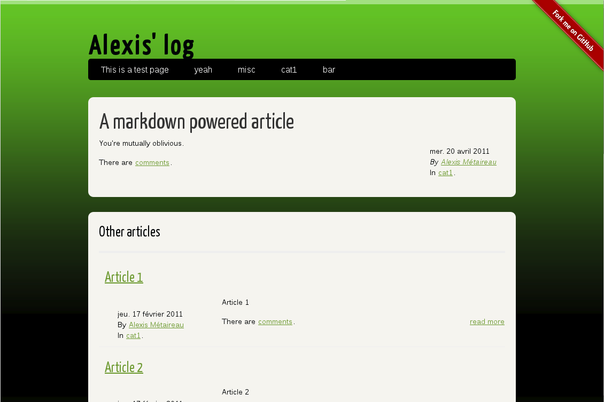

Style specific setting
======================

The tags.html file which contains the tag cloud is unreachable from the blog because there is no hyoerlink to it.

To make the tag cloud accessible from the navigation bar add ::

    $ MENUITEMS = (('Tags', 'tags.html'),)

in your settings.

Screenshot
----------

