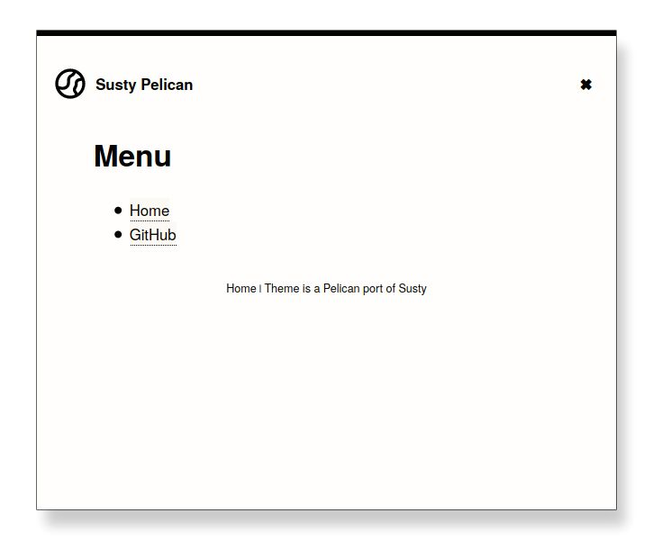

Susty Pelican
=============
This is a port of the Susty_ Wordpress theme to be used
with the Pelican_ static site generator.

Demo
----
A `live demo`_ is available.

Screenshots
-----------
**Main page listing all posts:**

.. image:: images/main_page.jpg
    :width: 300px
    :alt: Main page

**Page with the site's navigation menu:**

**A blog post:**

How to use
----------
1. Download the `latest version`_ of the theme.
2. Extract the zip archive to a subdirectory
   within your Pelican project, for example,
   under ``themes/susty-pelican``::

        your-pelican-project
        │
        ├── content
        │   └── index.rst
        ├── Makefile
        ├── pelicanconf.py
        ├── publishconf.py
        ├── tasks.py
        ├── themes
            └── susty-pelican
                ├── README.rst
                ├── static
                └── templates

3. Update ``pelicanconf.py`` to use the new theme::

    THEME = 'themes/susty-pelican'

4. If you like to add pages to the site's navigation menu, add to
   ``pelicanconf.py``::

        TEMPLATE_PAGES = {'menu.html': 'menu.html'}

   Then add all your pages to the ``MENUITEMS`` variable in
   ``pelicanconf.py``, for example::

        MENUITEMS = (
            ('Home', 'https://vimalkvn.github.io/susty-pelican'),
            ('GitHub', 'https://github.com/vimalkvn/susty-pelican')
        )

Credits
-------
* Susty_ Wordpress theme by Jack Lenox.
* Theme icon is from the `Eva Icons`_ project.
* Templates are from the Pelican builtin theme.

License
-------
GPL v3

.. Links
.. _Eva Icons: https://github.com/akveo/eva-icons
.. _latest version: https://github.com/vimalkvn/susty-pelican/archive/master.zip
.. _live demo: https://vimalkvn.github.io/susty-pelican
.. _Pelican: https://github.com/getpelican/pelican
.. _Susty: https://github.com/jacklenox/susty
