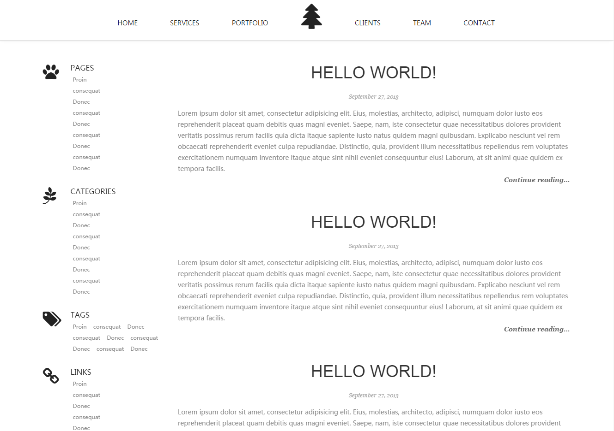

# Threnetes Theme

## What is Threnetes Theme?

This is a new theme for [Pelican][1] based on source code of Bootstrap Theme and [Knight-Bootstrap-Theme][2].

## Preview

This is a [live demo][3] with Threnetes Theme.

## Features

* Beautiful Design – All of our templates have been crafted with great care and attention to details.
* Built With Bootstrap – Bootstrap framework allows you to quickly kickstart any web development projects.
* Fully Customizable – Our templates can be easily customized to fit your wants and needs.
* Support Plugins - This theme support the plugins [Disqus][4] and Google Analytics.

## Screenshot

## License

The MIT License.

[1]: http://blog.getpelican.com/
[2]: http://w3goods.com/freebies/knight-free-bootstrap-theme
[3]: http://allotory.github.io/
[4]: https://disqus.com/