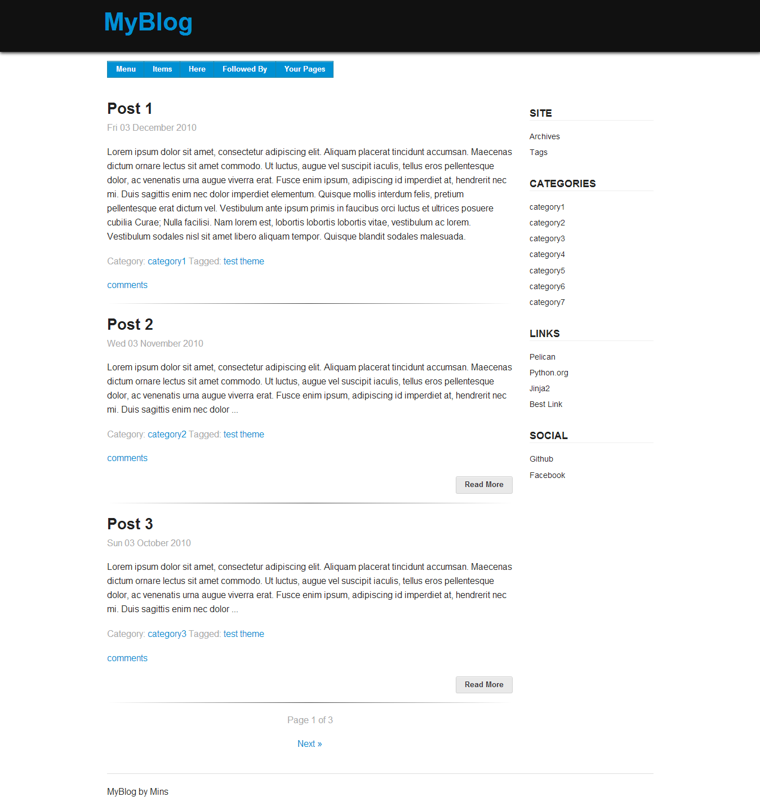

TuxLite ZF Theme
================

A mobile first theme that leverages the Zurb Foundation v4 framework. Minimalist two column, 
right sidebar design. Sidebar goes below main content when viewed on mobile devices.

Customization is all done and documented in style.css.

Menu items and pages can be added to the top navigation bar via pelican settings file.

Screenshot below.

