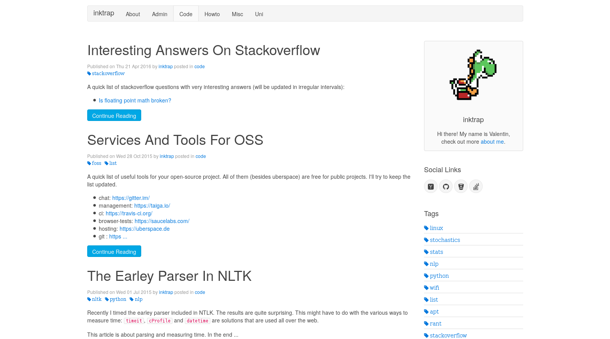

# ABOUT

``pelican-uikit`` is a port of the [uikit demo for a blog
layout](http://getuikit.com/docs/layouts_blog.html) to
[pelican](http://getpelican.com). You can currently browse a demo at [inktrap's
blog](https://blog.inktrap.org). This theme

 - can be customized by the [uikit-customizer](http://getuikit.com/docs/customizer.html)
 - is responsive and works for mobile devices
 - uses HTML5 semantic markup
 - is pretty dry due to some custom makros for sidebar links and license information (see [inktrap's gists](https://gist.github.com/inktrap/bff03f3f8ae6c671115e266c70ec20cb))
 - tries to be SEO ready (… this could be improved, but I don't care that much about SEO)
 - can be a boilerplate for your own experiments with uikit

# CUSTOMIZATION

## favicon

How to **use a custom favicon**:
 - go to <http://realfavicongenerator.net/> and use this custom path: ``/theme/ico/favicon/``.
 - then unzip the file to ``/themes/uikit/static/ico/favicon/`` (and ``themes`` is wherever you store your themes.)
 - done!

## author

 - change the following values (the default settings are my personal ones):

~~~
# this name is used for navigation and display
AUTHOR=u'inktrap'

# a shorthand/surname/whatever, used in the sidebar
AUTHOR_REAL = u'Valentin'

# put an image into uikit/static/img/ and change this
# variable to the name of the image. The default is author.svg
AUTHOR_IMAGE = u'author.svg'
~~~

## uikit

To use a different uikit-style simply change the ``STYLE`` variable in ``pelicanconf.py``. See the section ``pelicanconf`` below for an example.

If you want to use an entirely different colorsheme, use [the customizer](http://getuikit.com/docs/customizer.html).

**Currently I always get the same css-file regardless of the modifications I made. I will either post a bug report or investigate this a little bit more.**

Copy the following files to ``themes/uikit/static/css``:

~~~
uikit.almost-flat.css
uikit.almost-flat.min.css
uikit.css
uikit.gradient.css
uikit.gradient.min.css
uikit.min.css
~~~

Hint: You can just generate the minified files yourself and if you don't want to change the ``STYLE``-setting you only have to download the one you need.

## pelicanconf

More specific settings for this theme.

### display tags and links and how many of them

~~~
# control the sidebar-tags/links with a simple setting.
# If the value
# is 0, all links will be displayed
# is negative, no links will be displayed
# is positive, that many links will be displayed

DISPLAY_TAGS_ON_SIDEBAR_LIMIT = 0
DISPLAY_LINKS_ON_SIDEBAR_LIMIT = 0
~~~

### choose an uikit style

~~~
# choose default, gradient or almost-flat:
STYLE = "default"
STYLE = "almost-flat"
STYLE = "gradient"
~~~

### capitalize headings

~~~
# wether to capitalize article headings
# False means everything is not transformed
CAPITALIZE_HEADINGS = True
~~~

### choose a license

~~~
# available licenses (see LICENSE['cc_name']):
# licenses in version 4.0
# by-nc
# by-nc-nd
# by-nc-sa
# by-nd
# by-nd-nc
# by-sa
# all icons are included locally,
# however you can use the icon hosted by <https://licensebuttons.net/>.
# compact (80x15) or normal (88x31) icon
LICENSE = {
    'cc_name':"by-sa",
    'hosted':False,
    'compact':True,
    'brief':False
    }
~~~

The license-chooser and the sidebar-links makros will likely be independent pelican-plugins soon.

# TODO

 - integrate/rework: archives.html period_archives.html authors.html categories.html tags.html
 - pagination support
 - check styling via the uikit customizer
 - change article headings to a smaller size so it is separate from the main heading
 - categories in chrome's responsive design mode are not uppercased

# MAYBE/PLANNED FEATURES

 - integrate mathjax
 - code-highlighting via pygments
 - use bower?
 - integrate disqus?
 - integrate piwik?
 - what about translations?

# LINKS

 - http://docs.getpelican.com/en/latest/themes.html
 - http://getuikit.com/docs/documentation_get-started.html
 - http://getuikit.com/docs/layouts_blog.html

