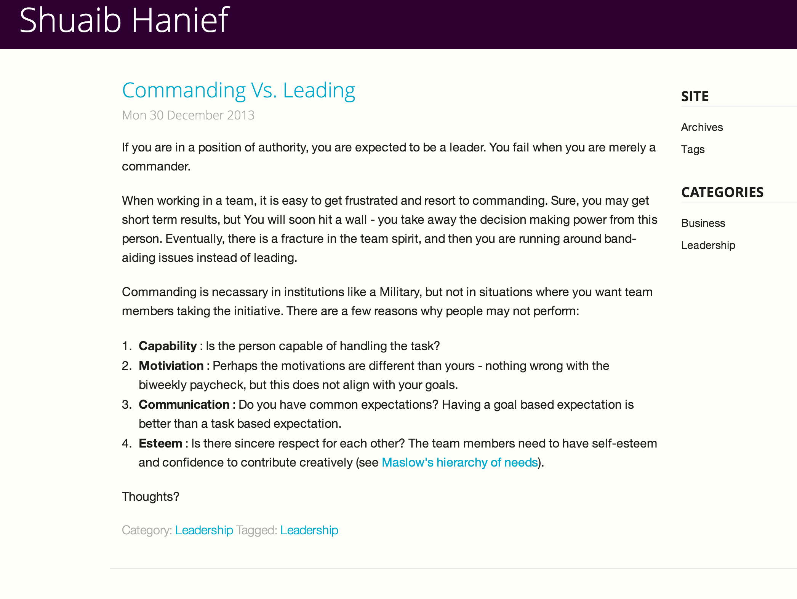

ZurbFoundation5 Theme
=====================

This theme is made from the TuxLite ZF Theme, and all credit goes to the author of that theme. I wanted to use the new [Zurb Foundation 5 Framework](http://foundation.zurb.com/) - I just updated it.

A mobile first theme that leverages the Zurb Foundation v5 framework. Minimalist two column, 
right sidebar design. Sidebar goes below main content when viewed on mobile devices.

Customization is all done and documented in style.css.

Menu items and pages can be added to the top navigation bar via pelican settings file.

Screenshot below.

